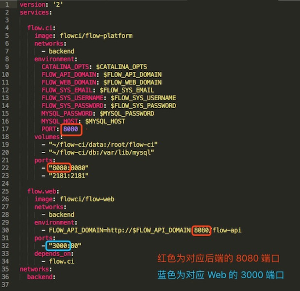

# 从 Docker 安装 flow.ci

## 安装 Docker 环境

> 如何安装 Docker 以及具体的安装步骤请查看 [Docker 官方文档](https://docs.docker.com/)

## 从 Docker Hub 镜像启动

flowci 在 Docker Hub 上提供了最新的镜像，用户可以方便的获取最新的镜像并开始 flow.ci 之旅。

1. 克隆 Docker 构建仓库

	> 在 flow.ci 的 Docker 构建仓库中，提供了快速启动以及相关的服务器配置
	
	- 通过 Git 的形式 Clone 代码，确保机器已经安装了 Git
	
	  `git clone https://github.com/flowci/docker.git`
	  
	- 直接通过 http 下载的形式下载代码，之后解压缩
	   
		`curl -L -o docker.zip https://github.com/FlowCI/docker/archive/master.zip`

2. 从 Docker 启动 flow.ci

    进入到上一步获取的代码目录，并执行 `./start-services.sh`， 之后可以访问 `http://localhost:3000` 进入 flowci。
 
	
	> 环境变量的设置:
	> 
	> - `FLOW_API_DOMAIN`： 部署的后端 API 域名地址， 为 8080 端口， 默认：`localhost`
	> - `FLOW_WEB_DOMAIN`： 部署的前端 Web 页面的域名地址，为 3000 端口，默认：`localhost`
	> - `FLOW_SYS_EMAIL`：flow.ci 系统管理员账号，默认是 `admin@flow.ci `
	> - `FLOW_SYS_USERNAME`：flow.ci 系统管理员的用户名，默认是 `admin` 
	> - `FLOW_SYS_PASSWORD`: flow.ci 系统管理员密码，默认是 `123456`
	> - `MYSQL_PASSWORD`： flow.ci MYSQL 数据库 `root` 用户的密码，默认为 `flowci`

	例如：在步骤1中代码目录为 `docker`，配置的域名为 `yourhost.com`，则可以通过以下命令启动

	```bash
	mkdir flowci 
	cd flowci 
	git clone https://github.com/flowci/docker.git
	cd docker 
	FLOW_API_DOMAIN=yourhost.com FLOW_WEB_DOMAIN=yourhost.com ./start-services.sh
	```
	
修改端口: Docker 启动默认后端为 8080 端口，Web 访问为 3000 端口，如果需要修改相应的端口 ( Agent 访问 API 的端口同时也需要修改)，则需要编辑 `docker-compose.yml` 文件，如下图：




## 从源代码构建 Docker 镜像并启动

除了从 Docker Hub 直接获取 flowci 的镜像之外，用户也可以通过以下命令，从源代码直接构建 Docker 镜像，

> 镜像名称的设置: 
>  在修改镜像名称后，还需要修改 `docker-compose.yml` 中对应的镜像名称
> 
> - `DOCKER_NAME_FLOWCI`: flowci 后端 API 的 image 名称，默认 `flowci/flow.ci.backend` 
> - `DOCKER_NAME_FLOW_WEB`: flowci 前端 Web 的 image 名称，默认 `flowci/flow.web`
> - `DOCKER_NAME_FLOWCI_AGENT`: flowci Agent 的 image 名称，默认 `flowci/flow.ci.agent` 


```bash
mkdir flowci 
cd flowci 
git clone https://github.com/flowci/flow-platform.git
git clone https://github.com/flowci/flow-web.git 
git clone https://github.com/flowci/docker.git 
cd docker 
./build-docker.sh
```

## 启动 Agent 

> 需要替换的环境变量:
> 
> - `FLOW_API_DOMAIN`： 为所配置的 API 的域，例如 localhost
> - `FLOW_TOKEN`:  Agent 启动令牌，如何获取请参见 [ Agent 管理 ](./admin_agent.md)
> - `PORT`: 如果 API 端口不为 8080 时，需要定义端口号


- 以 Docker 方式启动
 
  `USE_DOCKER=true ./start-agent.sh $FLOW_API_DOMAIN $FLOW_TOKEN`

- Java 方式启动
  > 需要准备 Java 1.8 的环境
  
  `./start-agent.sh $FLOW_API_DOMAIN $FLOW_TOKEN`
  


<br/><br/><br/>

<div id="bom">
<a href="./cf_osx.md">上一节：基于 Mac OS 的安装 </a> | 
<a href="./quick_iosBuild.md">下一节：iOS 项目构建 </a>
</div>

<link rel="stylesheet" rev="stylesheet" href="flow.css" type="text/css"/> 
