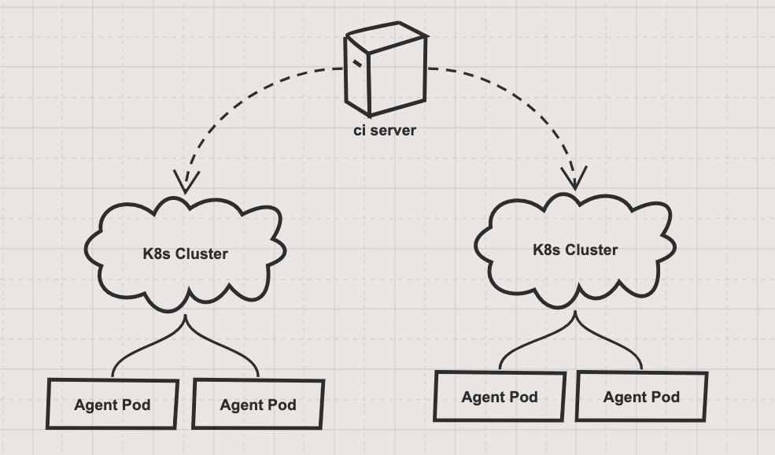
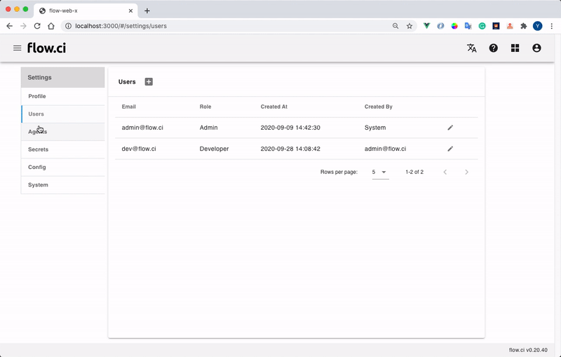

# 可伸缩 Agent: 配置 k8s

配置 k8s 集群后，flow.ci 会自动创建，并管理 Agent Pod



## 从管理员界面配置 k8s

* 创建 `Settings` -> `Agents` -> `+`
* 选择 `Dynamic agent`
* 输入一个名称
* 输入标签 (可选)

  Agent 标签用于 YAML `selector` 配置，可以让工作流运行在指定的 Agent 中。例如在 Agent 中配置了 `ios` 标签，并且在 YAML 中定义了如下的 `selector`， 则该工作流只会运行在带有 `ios` 标签的 Agent 中.

  ```yaml
  selector:
    label:
      - ios
  ```

* 填入集群信息
  * Namespace: k8s namespace 用于创建 Agent Pod

  * Secret: kube config 秘钥，用于访问和创建 Agent Pod. (如果没有此类型的密钥，请先创建，参考[如何创建 Kubeconfig 密钥](cn/secret/kubeconfig.md#k8s-kubeconfig-类型的密钥))

  * Max Pool Size: 最大可运行 Agent 的数量

* 点击 `Save`

  创建的 k8s 主机将会显示在列表中

