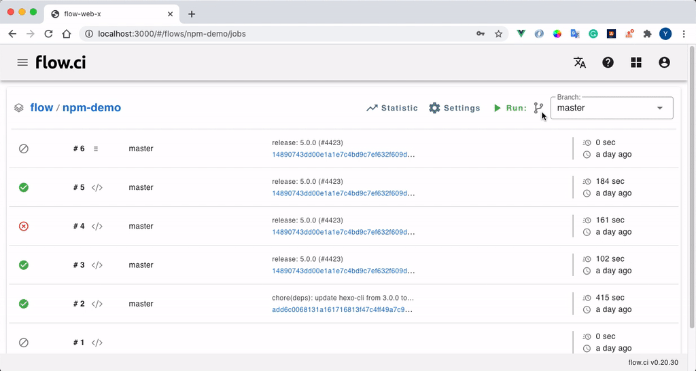

# 手动配置 Agent

任务是运行在 Agent 上的，所以在任务开始之前，需要创建并启动至少一个 Agent。

> 如果从 [docker-install](https://github.com/FlowCI/docker-install.git) 安装 flow.ci, 默认会配置一个自动 Agent 启动器，所以可以不用配置 Agent，直接运行任务即可

## 1. 从管理员页面创建 Agent

* 点击 `Settings` -> `Agents` -> `+`
* 选择 `Manual agent`
* 输入一个名称
* 定义标签 (可选)

  Agent 标签用于 YAML `selector` 配置，可以让工作流运行在指定的 Agent 中。例如在 Agent 中配置了 `ios` 标签，并且在 YAML 中定义了如下的 `selector`， 则该工作流只会运行在带有 `ios` 标签的 Agent 中.

  ```yaml
  selector:
    label:
      - ios
  ```

* 保存 `Save`
  
  新创建的 Agent 会在列表中显示，可以从列表中拷贝 token



## 2. 启动 Agent


#### 2.1 从 Docker 启动

最简单的方式为 Git 克隆 [docker-install](https://github.com/flowci/docker-install) 仓库，之后运行 `./agent.sh -t <token> -u <server url> start`，填入 token 和 server url 即可。

或者可以使用以下 Bash 脚本，填入 `FLOWCI_SERVER_URL` 和 `FLOWCI_AGENT_TOKEN`

```bash
docker run -it \
-e FLOWCI_SERVER_URL={ci_server_url} \
-e FLOWCI_AGENT_TOKEN={agent_token} \
-e FLOWCI_AGENT_VOLUMES="name=pyenv,dest=/ci/python,script=init.sh,image=flowci/pyenv,init=init-pyenv-volume.sh" \
-v /var/run/docker.sock:/var/run/docker.sock \
flowci/agent
```

#### 2.2 从 Binary 启动

您可以从 [这里](https://github.com/FlowCI/flow-agent-x/releases) 找到最新的 Agent 版本.

需要的环境 （如果要获得 flow.ci 所有功能):
- Python >= 3.6
  - required pip libs:  `pip install requests==2.22.0 python-lib-flow.ci`
- Docker


##### Linux

替换 `{version}`, `{ci_server_url}`, `{agent_token}` 后运行以下 Bash 脚本

```bash
wget https://github.com/FlowCI/flow-agent-x/releases/download/{version}/flow-agent-x-linux
chmod +x flow-agent-x-linux
./flow-agent-x-linux -u {ci_server_url} -t {agent_token} -m name=pyenv,dest=/ci/python,script=init.sh,image=flowci/pyenv,init=init-pyenv-volume.sh
```

##### MacOS (intel)

替换 `{version}`, `{ci_server_url}`, `{agent_token}` 后运行以下 Bash 脚本

```bash
wget https://github.com/FlowCI/flow-agent-x/releases/download/{version}/flow-agent-x-mac
chmod +x flow-agent-x-mac
./flow-agent-x-mac -u {ci_server_url} -t {agent_token} -m name=pyenv,dest=/ci/python,script=init.sh,image=flowci/pyenv,init=init-pyenv-volume.sh
```

##### Windows (x64)

替换 `{version}`, `{ci_server_url}`, `{agent_token}` 后运行以下 PowerShell 脚本

```powershell
Invoke-WebRequest https://github.com/FlowCI/flow-agent-x/releases/download/{version}/flow-agent-x-win -OutFile flow-agent-x-win.exe
.\flow-agent-x-linux -u {ci_server_url} -t {agent_token} -m name=pyenv,dest=/ci/python,script=init.sh,image=flowci/pyenv,init=init-pyenv-volume.sh
```
