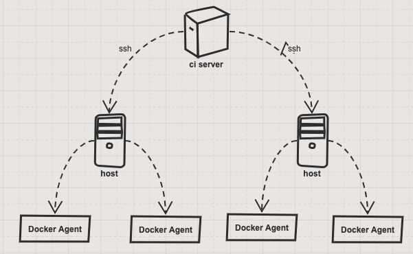
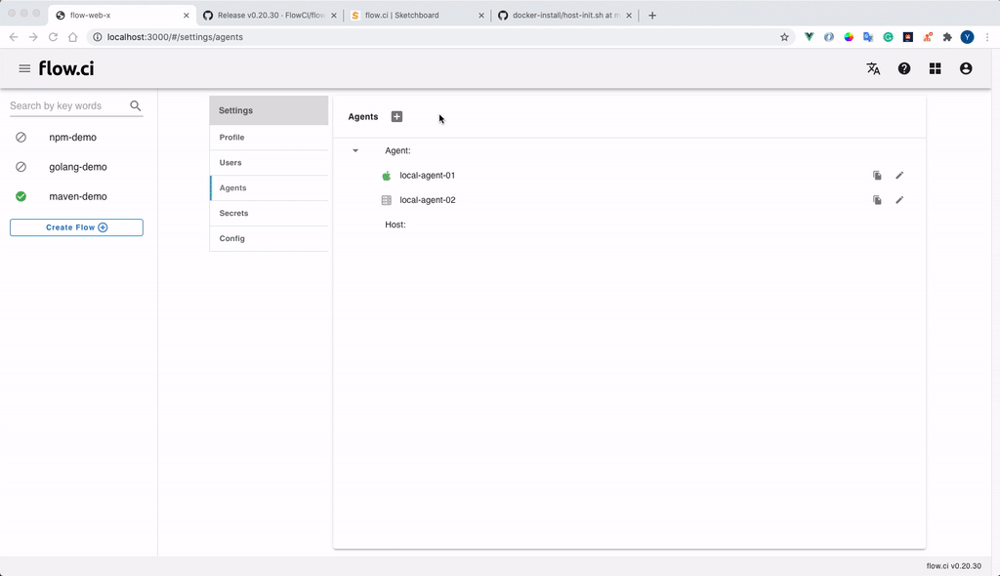
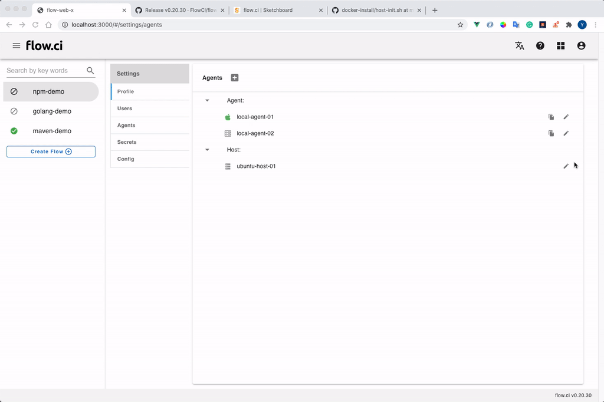

# 可伸缩 Agent: 配置 SSH 主机

配置 SSH 主机后，flow.ci 会自动通过 SSH 的方式创建并管理 Docker Agent。



## 1. 从管理员界面创建 SSH 主机

* 创建 `Settings` -> `Agents` -> `+`
* 选择 `Dynamic agent`
* 输入一个名称
* 输入标签 (可选)

  Agent 标签用于 YAML `selector` 配置，可以让工作流运行在指定的 Agent 中。例如在 Agent 中配置了 `ios` 标签，并且在 YAML 中定义了如下的 `selector`， 则该工作流只会运行在带有 `ios` 标签的 Agent 中.

  ```yaml
  selector:
    label:
      - ios
  ```

* 填入 SSH 信息
  * Secret: 选择一个 SSH key 类型的秘钥（如果没有此类型的密钥，请先创建，参考[如何创建 SSH-RSA 密钥](cn/secret/ssh-rsa.md#ssh-rsa-类型的秘钥)）

  * User: SSH 登录的用户名

  * IP: 主机的 IP 地址

  * Max Pool Size: 最大可运行 Docker Agent 的数量

* 点击 `Save`

  创建的 SSH 主机将会显示在列表中



## 2. 配置 SSH 主机的环境

* 拷贝该公钥到 __目标主机__ 中的 `.ssh/authorzied_keys` 目录，已获得访问权限

* 在主机中运行 [初始化脚本](https://github.com/FlowCI/docker-install/blob/master/host-init.sh)，配置 Docker Agent 的运行环境

* 测试连接

  