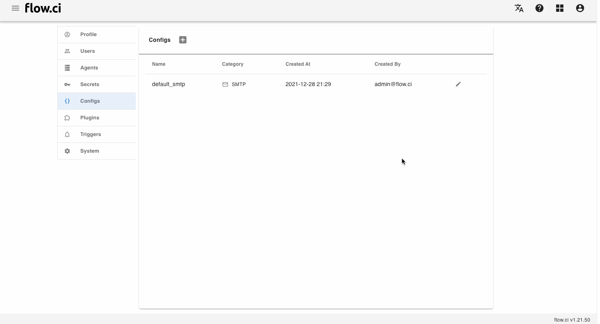

# 任意配置 (text)

## 创建配置

1. 点击 `Settings` -> `Config` -> `+`
2. 输入一个名称
3. 选择 `Text` 类型
4. 填入配置信息，可以为任意格式
5. 保存 `Save`




## 如何使用

- 从 Step 中获取 `SMTP` 配置

  例如: 需要自定义 Maven .m2 中的 `settings.xml`, 可以输入所需要的 `xml` 配置
  ```xml
  <settings>
    <proxies>
       <proxy>
          ...
       </proxy>
    </proxies>
  </settings>
  ```

  之后在 YAML 配置中，通过 `configs` 引入

  ```yaml
  steps:
  - name: set maven settings
    configs:
    - my_xml_config
    bash: |
      echo ${my_xml_config}
      echo ${my_xml_config} > ~/.m2/settings.xml
  ```