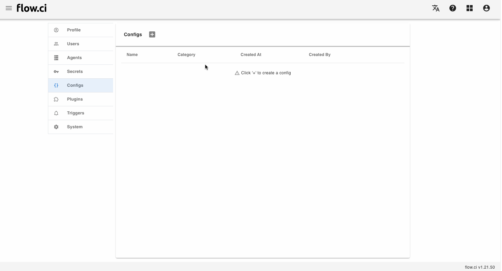
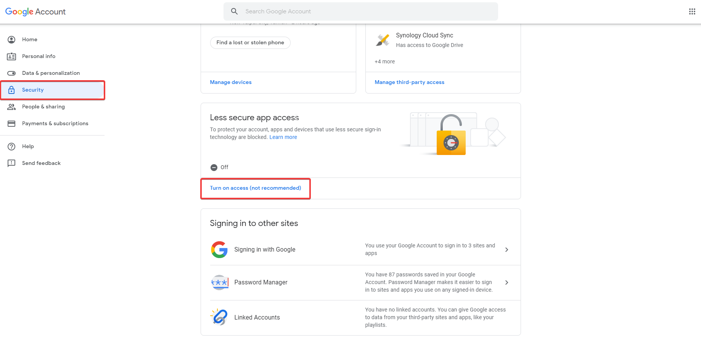

# SMTP 配置

## 创建配置

1. 点击 `Settings` -> `Config` -> `+`
2. 输入一个名称
3. 选择 `SMTP` 类型
4. 填入所需的信息
   - `Server`
   - `Port`
   - `Username`
   - `Password`
   - 选择加密类型 `None`, `SSL` or `TLS`
5. 保存 `Save`



## 如何使用

- 从 Step 中获取 `SMTP` 配置

  例如: 创建了一个名为 `default_smtp` 的 `SMTP` 类型的配置，可以在 YAML 配置中，通过 `configs` 引入

  ```yaml
  steps:
  - name: smtp config demo
    configs:
    - default_smtp
    bash: |
      echo ${default_smtp_SERVER}
      echo ${default_smtp_PORT}
      echo ${default_smtp_SECURE_TYPE}
      echo ${default_smtp_AUTH_USERNAME}
      echo ${default_smtp_AUTH_PASSWORD}
  ```

- 在 `触发器 (Trigger)` 中使用

  例如配置 gmail 发送 任务结束通知 邮件:
  - `Server`: stmp.gmail.com
  - `Port`: 587
  - `Username`: gmail 的用户名
  - `Password`: gmail 的密码
  - 选择 `TLS`

  此外还需要登陆 Gmail 
  找到 `Security > Less secure app access`
  点击 `Click Turn on access`
  
  

  配置好后，设置触发器，[请参见](cn/trigger/email.md)
