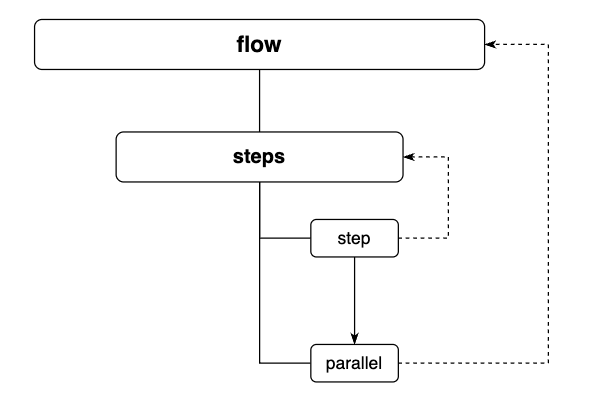
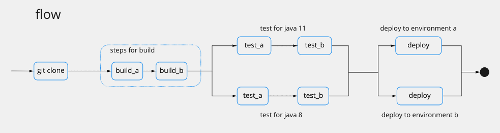

# 工作流结构

工作流(flow) 是 flow.ci 的最基本的组成。

构成工作流 (flow) 的基本元素有:
- 步骤列表 (steps)
- 执行步骤 (step)
- 并行步骤 (parallel)




### 举个例子




使用 YAML 配置来表示以上结构:

```yaml

steps:
  - name: git clone
    bash: |
      echo "run git clone"

  - name: steps for build
    docker:
      image: "my build image"
    steps:
      - name: build_a
        bash: |
          echo "run build step a"
      - name: build_b
        bash: |
          echo "run build step b"
  
  - parallel:
      java_8_test:
        docker:
          image: "java 8 image"
        steps:
          - name: test a
            bash: |
              echo "run test a for java 8"
          - name: test b
            bash: |
              echo "run test b for java 8"

      java_11_test:
        docker:
          image: "java 11 image"
        steps:
          - name: test a
            bash: |
              echo "run test a for java 11"
          - name: test b
            bash: |
              echo "run test b for java 11"


  - parallel:
      deploy_to_a:
        steps:
          - name: deploy
            bash: |
              echo "deploy to environment a"

      deploy_to_b:
        steps:
          - name: deploy
            bash: |
              echo "deploy to environment b"

```

更详细的 YAML 配置，请查看 [YAML 配置参考](/cn/yml/reference_v1)