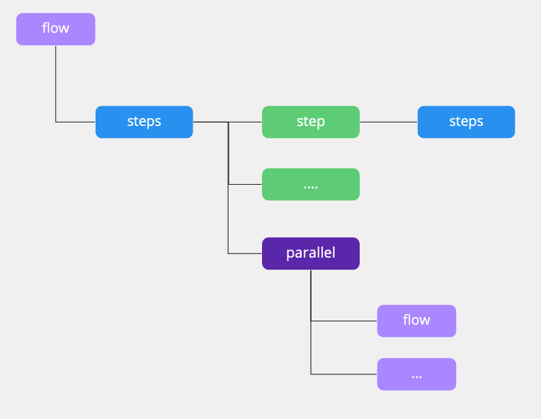

# 工作流结构

工作流(flow) 是 flow.ci 的最基本的组成。

构成工作流 (flow) 的基本元素有:
- 步骤列表 (steps)
- 执行步骤 (step)
- 并行步骤 (parallel)

它们之间的关系由下图所示:



对应的 YAML 配置为:

```yaml
steps:
  - name: step 1
    bash: |
      echo "step 1"

  - name: step 2
    bash: |
      echo "step 2"

  - steps:
    - name: step 1_1
      bash: |
        echo "step 1.1"

    - name: step 1_2
      bash: |
        echo "step 1.2"
  
  - steps:
    - name: step 2_1
      bash: |
        echo "step 2.1"

    - name: step 2_2
      bash: |
        echo "step 2.2"

  - parallel:
      p_flow_A:
        steps:
          - name: step A_1
            bash: |
              echo "step A.1 from parallel flow A"

          - name: step A_2
            bash: |
              echo "step A.2 from parallel flow A"
        
      p_flow_B:
        steps:
          - name: step B_1
            bash: |
                echo "step B.1 from parallel flow B"

          - name: step B_2
            bash: |
                echo "step B.2 from parallel flow B"
```
