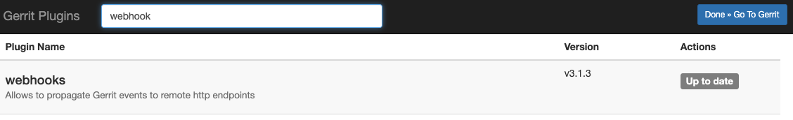

# Gerrit 集成

## 添加访问权限

- 从 `Settings -> Secret` 中 copy 相应的公钥
- 打开 Gerrit 页面 `{your_gerrit_host}/settings/#SSHKeys`
- 黏贴公钥，保存后，flow.ci 就可获得该 GitLab 项目的访问权限


## 配置 Git 触发事件 (Webhook)

1. 确定 [webhook 插件](https://gerrit.googlesource.com/plugins/webhooks/) 已经在 Gerrit 上安装, 或也可以从 Gerrit plugin manager 中安装

    


2. 进入已经从 Gerrit 上 clone 到本地项目仓库, 进入 `meta/config` 分之

    ```bash
    git fetch origin refs/meta/config:refs/remotes/origin/meta/config
    git checkout meta/config
    ```

3.  从工作流设置中复制 webhook 链接

    > 提示: 当前 CI 的主机需要有公网能访问的 IP 或者 域名，否则无法收到触发事件。如果无法配置公网访问，可以使用 [ngrok](https://ngrok.com/) 等工具来获取公网 -> 内网映射。

    


4. 添加一下配置到 `webhooks.config` 文件 (如果文件不存在可创建)

    > flow.ci 目前仅支持 `patchset-created` Gerrit 事件

    ```
    [remote "flowci_pathset_created"]
        url = {从第3步拷贝的 URL 地址}
        maxTries = 1
        sslVerify = false
        event = patchset-created
    ```

5. 保存更改到 `meta/config` 分支

    ```
    git push origin meta/config:meta/config
    ```


## 验证 Gerrit 配置

- Verify permission for repo:

  可以点击 `Test` 按钮验证访问权限是否配置正确.
  
  

## 配置 CI 任务状态写入到 Gerrit 的权限

1. 在 Gerrit 中创建 Http Credential

    我们须创建一个 `HTTP Credentials (GENERATE NEW PASSWORD)` 以便让 flow.ci 获得任务状态的写入权限，可以在 Gerrit `{your_gerrit_host}/settings/#HTTPCredentials` 页面创建。

    

2. 添加密码到 flow.ci 密钥
    
    在 flow.ci 中打开添加密钥页面  `Settings -> Secret -> +`，黏贴从 Gerrit 中拷贝的密码，并保存。

    

3. flow.ci 中配置 Gerrit

    在 flow.ci 中打开 Git 集成页面 `Settings -> Git -> +`, 选择 `Gerrit`, 输入 Gerrit 地址, 之后选择上一步所添加的密钥

    

4. 任务状态显示

    如果一切配置正确，当 CI 任务完成后，Gerrit PatchSet 中即可显示任务状态。

    