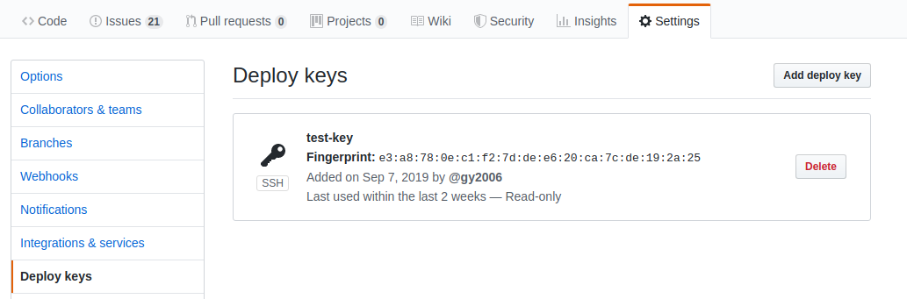
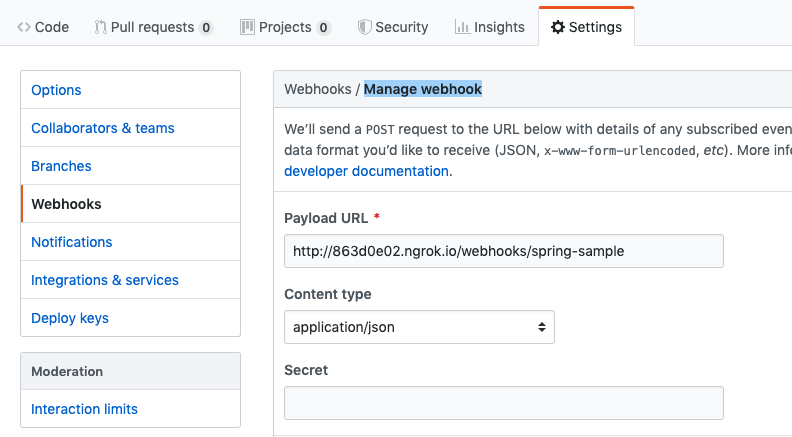
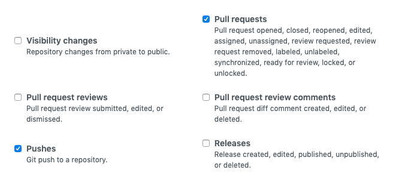
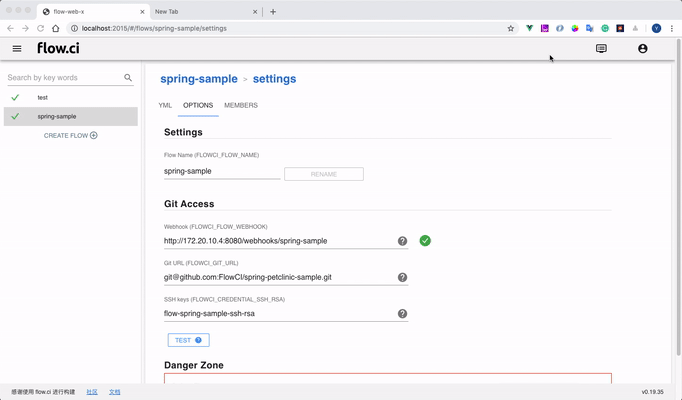

# GitHub 集成

## 添加访问权限

- 从 `Settings -> Secret` 中 copy 相应的公钥
- 打开 GitHub 页面，在项目设置 `Settings > Deploy key` 选择 `Add deploy key`
- Paste 公钥，保存后，flow.ci 就可获得该 GitHub 项目的访问权限

> GitHub 不可以在多个项目中使用同一个公钥， 如果需要用同一个公钥访问多个仓库，建议在 GitHub 中创建一个特殊的用户比如 `CI User`，之后再该用户中添加 SSH 公钥，可参考 [adding new ssh key to your GitHub account](https://help.github.com/en/articles/adding-a-new-ssh-key-to-your-github-account).

## 配置 Git 触发事件 (Webhook)

触发事件（Webhook）是用于当有 Push，Tag 或者 Pull Request 等操作时时，触发 CI 任务。

1. 从工作流设置中复制 webhook 链接
   > 提示: 当前 CI 的主机需要有公网能访问的 IP 或者 域名，否则无法收到触发事件。如果无法配置公网访问，可以使用 [ngrok](https://ngrok.com/) 等工具来获取公网 -> 内网映射。

   

2. 设置 GitHub webhook

- Payload URL: 粘贴 webhook 链接

  > 如果使用 `ngrok`, 请手动替换地址的第一部分, 例如: `http://172.20.10.4/webhooks/spring-sample` to `http://7e9ea9dc.ngrok.io/webhooks/spring-sample`

- Content type: `application/json`

  

- 选择触发事件

  - 选择 `Let me select individual events`
  - 选择 `push` and `pull request`

  

## 验证 GitHub 配置

- 触发事件 Webhook:

  当配置完成后，GitHub 会自动发送一个验证事件 ping 到 webhook 的地址，当 flow.ci 接收到这个事件后，会出现一个绿色的标识。

- 验证权限:
  
  可以点击 `Test` 按钮验证访问权限是否配置正确.

  
