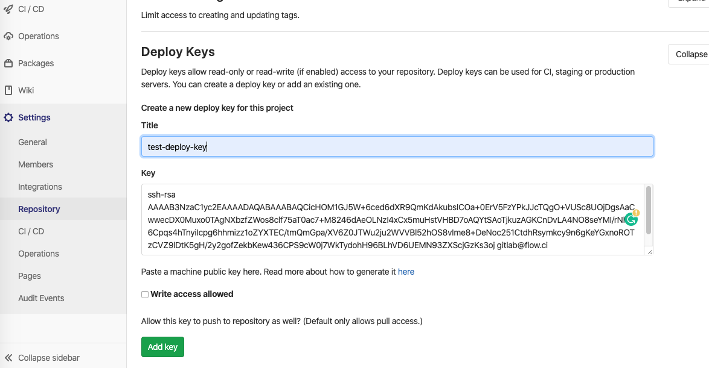
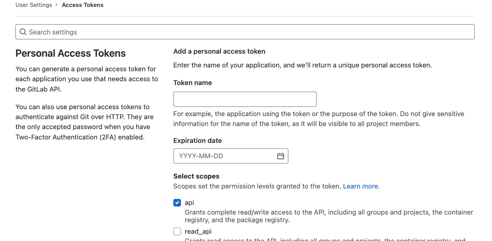
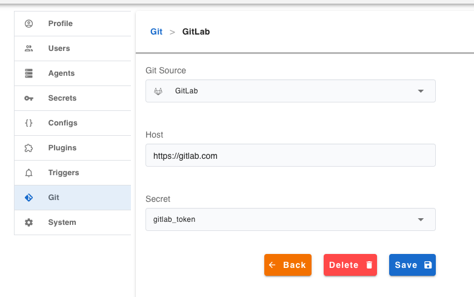

# GitLab 集成

## 添加访问权限

- 从 `Settings -> Secret` 中 copy 相应的公钥
- 打开 GitLab 页面，在项目设置 `Settings > Repository -> Deploy Keys`
- Paste 公钥，保存后，flow.ci 就可获得该 GitLab 项目的访问权限

> GitLab 不可以在多个项目中使用同一个公钥， 如果需要用同一个公钥访问多个仓库，建议在 GitLab 中创建一个特殊的用户比如 `CI User`，之后再该用户中添加 SSH 公钥。

## 配置 Git 触发事件 (Webhook)

触发事件（Webhook）是用于当有 Push，Tag 或者 Pull Request 等操作时时，触发 CI 任务。

1. 从工作流设置中复制 webhook 链接
   > 提示: 当前 CI 的主机需要有公网能访问的 IP 或者 域名，否则无法收到触发事件。如果无法配置公网访问，可以使用 [ngrok](https://ngrok.com/) 等工具来获取公网 -> 内网映射。

   

2. 设置 GitLab webhook

- URL: 粘贴 webhook 链接

  > 如果使用 `ngrok`, 请手动替换地址的第一部分, 例如: `http://172.20.10.4/webhooks/spring-sample` to `http://7e9ea9dc.ngrok.io/webhooks/spring-sample`

- 选择触发事件
  
  选择事件 `Push events`, `Tag push events` 和 `Merge request events`
  
  

## 验证 GitLab 配置

- 验证权限:
  
  可以点击 `Test` 按钮验证访问权限是否配置正确.

  

##  配置 CI 任务状态写入到 GitLab 的权限

1. 在 GitLab 中创建 Token

    In order to have permission for writing job status back to GitLab, we need to create a token with `api` permission from https://gitlab.com/-/profile/personal_access_tokens (replace `https://gitlab.com` to your own GitLab host when access private gitlab)

    我们须创建一个拥有 `api` 权限的 Token，以便让 flow.ci 获得任务状态的写入权限，可以在 GitLab `https://gitlab.com/-/profile/personal_access_tokens` 页面中创建 (如私有 GitLab 仓库，请替换 `https//gitlab.com`)。

    

2. 添加 Token 到 flow.ci 密钥

    在 flow.ci 中打开添加密钥页面  `Settings -> Secret -> +`，黏贴从 GitLab 中拷贝的 Token，并保存。

    

3. flow.ci 中配置 GitLab

    在 flow.ci 中打开 Git 集成页面 `Settings -> Git -> +`, 选择 `GitLab`, 输入 GitLab 地址, 之后选择上一步所添加的密钥

    

4. 任务状态显示

    如果一切配置正确，当 CI 任务完成后，GitLab 的提交中即可显示任务状态。

    