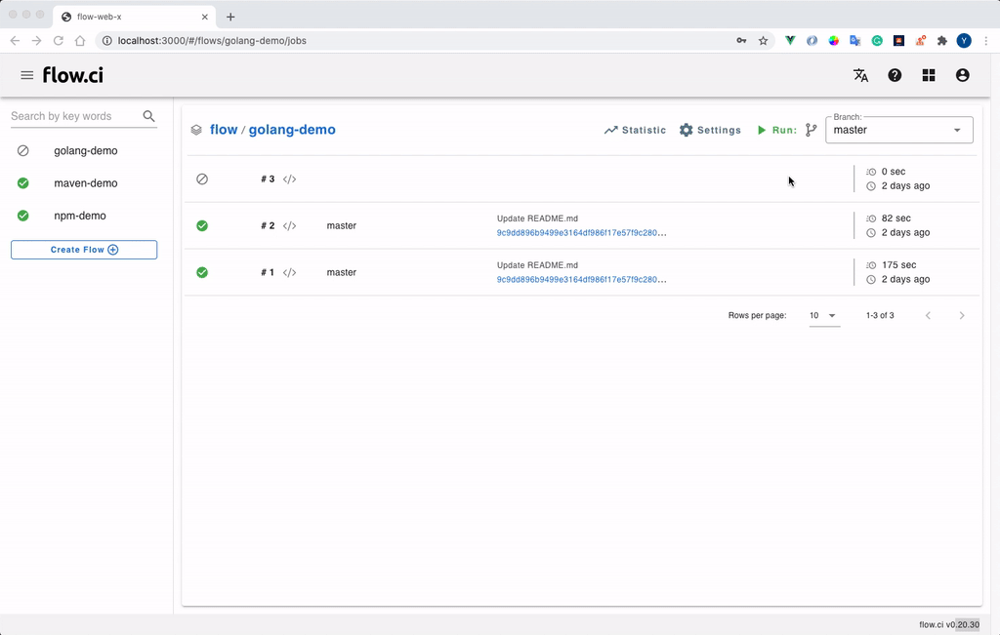

# 工作流中配置 Git

## 配置工作流

flow.ci 通过 [git clone](https://github.com/flowci-plugins/gitclone) 插件来实现 clone 代码.

```yaml
envs:
  FLOWCI_GIT_URL: "https://github.com/FlowCI/spring-petclinic-sample.git" ## 替换对应的仓库地址, 支持 https 或 ssh

steps:
- name: clone
  docker:
    image: flowci/debian-git ## 也可使用带有 git 命令的其他 image。如果 Agent 运行环境带有 Git 命令，也可以不使用 docker 定义
  plugin: 'gitclone'
```


## 配置 SSH KEY

如果 Git 链接为 __SSH__ 协议，例如 `git@github.com:FlowCI/docs.git`, 则需要配置 __SSH-RSA__ 秘钥已获得代码的访问权限.

1. 创建 SSH-RSA 秘钥

   - 进入管理员界面 `Settings -> Secret -> +`
   - 输入一个秘钥名称， 例如 `ras-test`
   - 选择 `SSH key` 类型
   - 点击生创建新的秘钥，或者 copy 已有的公钥私钥
   - 保存

   > 如果使用已有的 SSH KEY，请复制 公钥 和 私钥

    

2. 配置秘钥到工作流

   `FLOWCI_GIT_CREDENTIAL` 用于 [Git clone 插件](https://github.com/flowci-plugins/gitclone) 使用哪个秘钥访问，可在 YAML 中设置该变量为秘钥名称。

   ```yaml
    envs:
      FLOWCI_GIT_CREDENTIAL: "rsa-test"

    steps:
    - name: clone
      docker:
        image: flowci/debian-git
      plugin: 'gitclone'
   ```

## Git 仓库中添加访问权限，及触发事件

不同 Git 仓库的访问权限，和触发事件的配置有略微差异，目前 flow.ci 支持的仓库有

- [GitHub](/cn/git/github.md)
- [GitLab](/cn/git/gitlab.md)
- [Gogs](/cn/git/gogs.md)
- [Gitee](/cn/git/gitee.md)

请点击相关 Git 仓库查看详细配置方法
