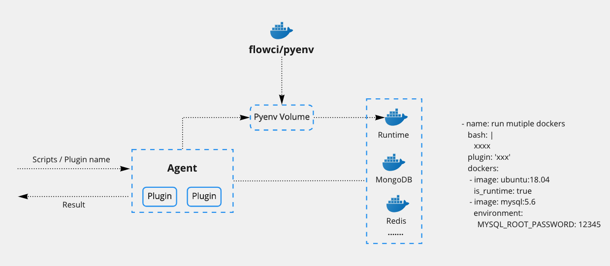

# 通过 Docker 配置运行环境

可通过在 YAML 中配置 `docker` / `dockers`, 来配置每个步骤所需要的运行环境

> 此功能需要 Agent 运行环境中安装 docker

## 配置 Docker image

工作流(flow) 和 执行步骤(step) 中，均支持 `docker` 定义。

在 YAML 定义了 `docker` 之后，步骤中的 `bash` 脚本会在 Docker 容器中执行。

### 在执行步骤(step) 使用 `docker`

当定义了 `docker.image` 后，步骤即会在 `openjdk:11` 或 `openjdk:8` 中的环境运行

```yaml
steps:
- name: step_1
  docker:
    image: "openjdk:11"
  bash: "Run from openjdk 11"

- name: step_2
  docker:
   image: "openjdk:8"
  bash: "Run from openjdk 8"
```

### 在工作流(flow) 使用 `docker`

当在 工作流 范围中定义了 `docker` 后，所有的步骤会使用该 `docker` 配置。

在 步骤 中有 `docker` 定义时，会使用此步骤中的配置。

```yaml
docker:
  image: "openjdk:11"

steps:
- name: step_1
  bash: "Run from openjdk 11"

- name: step_2
  docker:
   image: "openjdk:8"
  bash: "Run from openjdk 8"

```

## 配置 __多个__ Docker image

步骤中同时需要多个服务时, 比如需要 `redis`, `mongodb` 等，则可通过配置 `dockers` 来实现，同时必须定义 `is_runtime` 来确定脚本的执行环境。

Agent 中内置了 `wait-for-it.sh` 等待脚本, 可使用该脚本来等待某个服务启动。

__例如__: 运行时需要 `mysql` 的服务, 可以添加 `mysql` 的镜像来获得该服务

```yaml
steps:
- name: run mutiple dockers
  dockers:
    - image: ubuntu:21.04
      is_runtime: true # 步骤脚本在此环境中执行
      
    - image: mysql:5.6
      environment:
        MYSQL_ROOT_PASSWORD: 12345
  bash: |
    ## 通过环境变量获取 container id
    echo "ubuntu:21.04 id = $CONTAINER_ID_0"
    echo "mysql:5.6 id    = $CONTAINER_ID_1"

    ## 通过环境变量获取 container IP 地址, 网络默认模式为 'bridge'
    echo "ubuntu:21.04 ip = $CONTAINER_IP_0"
    echo "mysql:5.6 ip    = $CONTAINER_IP_1"

    ## 内置 wait-for-it.sh 脚本，可以等待 'mysql' 服务启动
    wait-for-it.sh ${CONTAINER_IP_1}:3306 -t 30
    if [ $? == 0 ];then
      docker run --network ${FLOWCI_AGENT_DOCKER_NETWORK} --rm mysql:5.6 mysql -h${CONTAINER_IP_1} -uroot -p12345 mysql -e "select * from user"
    fi
  ```

  