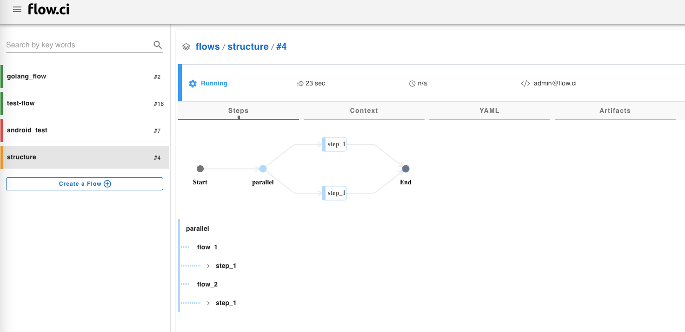

# 并行执行

并行执行可以大幅提升任务的运行效率。

YAML 中可以通过 `parallel` 来配置并行执行, 在 `parallel` 节点下，可配置多个并行工作流。

当并行执行时，需要多个空闲 Agent。如果当前环境只有一个空闲的 Agent，即使配置了 `parallel` 也会顺序执行。

```yaml
steps:
- parallel:
    flow_1: ## 定义并行执行的工作流名称
      steps:
      - name: step_1
        bash: |
          echo "step 1 from flow 1"
            
    flow_2: ## 定义并行执行的工作流名称
      steps:
      - name: step_1
        bash: |
          echo "step 1 from flow 2"

```



例如：需要测试在 `java 8` 和 `java 11` 环境下运行的运行情况

```yaml
steps:
- name: git clone
  bash: |
    echo "run git clone"

- parallel:
    java_8_test:
      docker:
        image: "java 8 image"
      steps:
        - name: test a
          bash: |
            echo "run test a for java 8"
        - name: test b
          bash: |
            echo "run test b for java 8"

    java_11_test:
      docker:
        image: "java 11 image"
      steps:
        - name: test a
          bash: |
            echo "run test a for java 11"
        - name: test b
          bash: |
            echo "run test b for java 11"
```