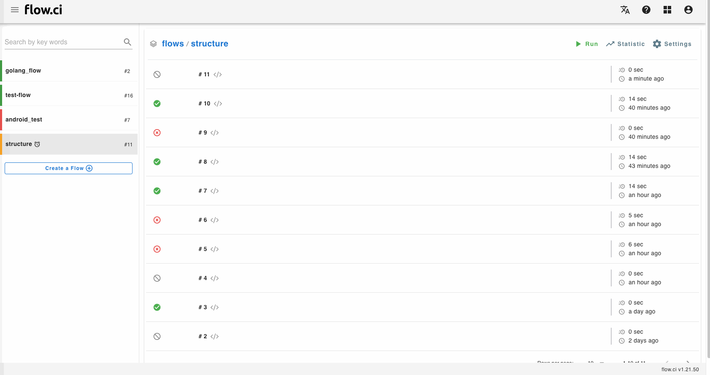

# 网页终端 (Web Terminals)

在任务运行时，如果有 __管理员权限__ 则用户可以在线访问终端环境，输入命令行进行在线调试.

当进入终端环境调试时，系统会等待终端退出后，才会执行下一步。

> 如果任务运行时间较短，没有时间从页面进入终端，则可以使用 `sleep xxx` 让任务飞一会儿

```yaml
steps:
  - name: step1
    bash: |
      echo "try web terminal"
      sleep 10
```

