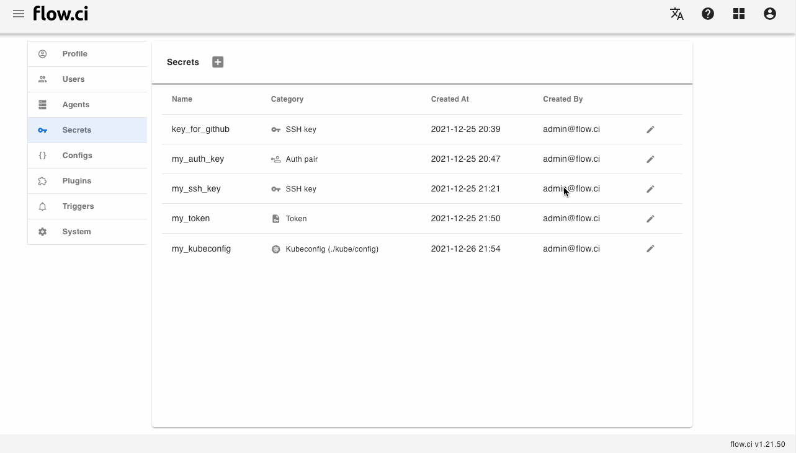
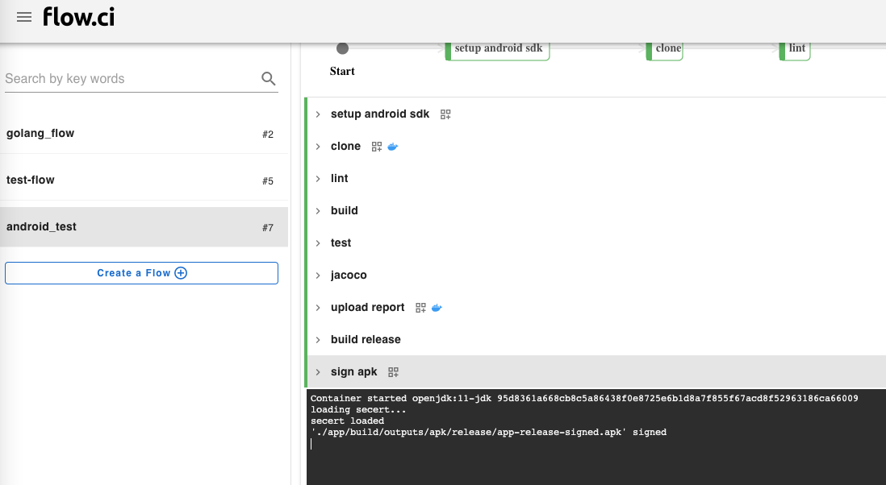

# `安卓签名` 密钥

## 创建密钥

1. 点击 `Settings` -> `Secret` -> `+`
2. 输入一个名称
3. 选择 `Android sign` 类型
4. 填入所需的信息
   - `Key store file`
   - `key store password`
   - `Key alias`
   - `Key password`
5. 保存 `Save`



## 如何使用

- 在 [android-signing](https://github.com/flowci-plugins/android-signing) 插件中使用: 

  在变量 `SIGN_SECRET` 中填入所对应的 `安卓签名` 类型的密钥名称。

  ```yaml
  - name: sign apk
    envs:
      SIGN_FILE_PATTERN: '*-unsigned.apk'
      SIGN_SECRET: my_android_sign
    plugin: android-signing
  ```

  如果签名成功，会在此步骤中显示 `'./xx/xx/xx/you_package.apk' signed`，例如：

  