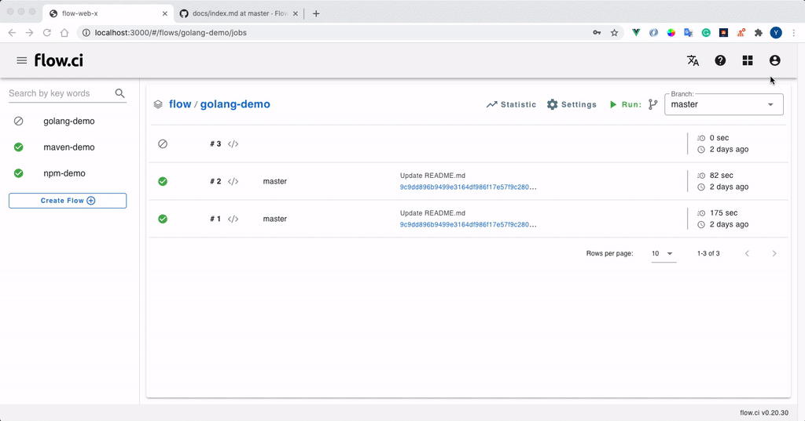

# `用户名密码` 类型的秘钥

## 创建密钥

1. 点击 `Settings` -> `Secret` -> `+`
2. 输入一个名称
3. 选择 `Auth pair` 类型
4. 输入用户名，密码
5. 保存



## 如何使用

- 从 `Step` 中获取 `用户名密码` 密钥

  例如: 创建了一个名为 `my_auth_key` 的 `用户名密码` 类型的密钥，可以在 YAML 配置中，通过 `secrets` 引入

  ```yaml
  steps:
    - name: get auth demo
      secrets:
      - my_auth_key
      bash: |
        echo ${my_auth_key_USERNAME}
        echo ${my_auth_key_PASSWORD}
  ```


