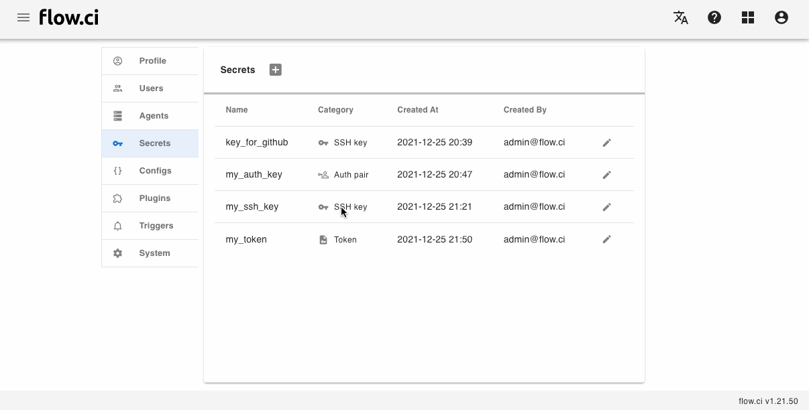

# K8s `kubeconfig` 类型的密钥

## 创建密钥

1. 点击 `Settings` -> `Secret` -> `+`
2. 输入一个名称
3. 选择 `Kubeconfig` 类型
4. 拷贝对应的配置到文本框
5. 保存 `Save`

## 如何使用

此类型密钥主要用于配置 K8s 可伸缩 Agent，如何配置[请参考](cn/agents/k8s_host.md)