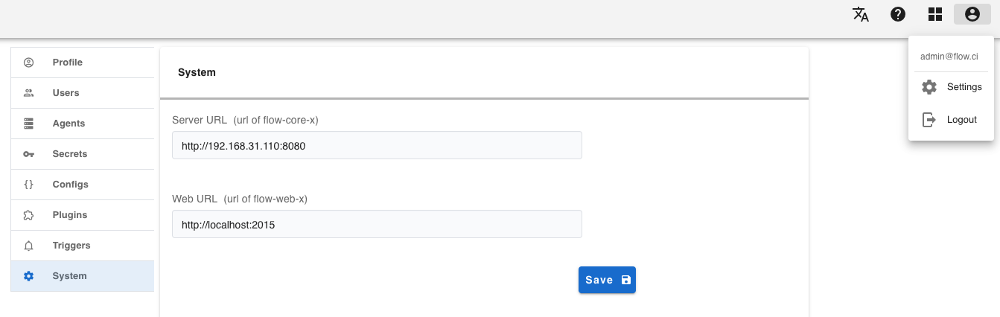
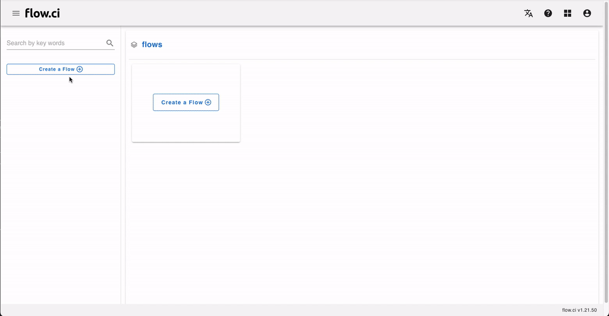
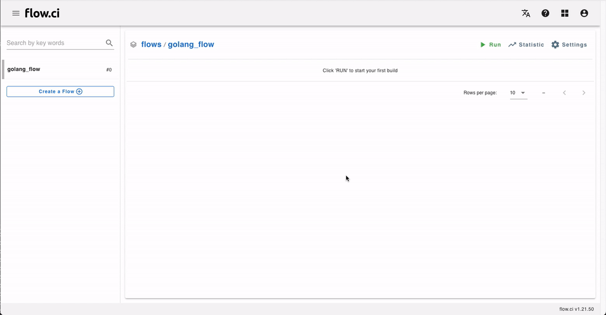

# 开始使用 flow.ci

## 安装

> 需要预先安装 [Docker](https://docs.docker.com/install/) & [Docker-Compose](https://docs.docker.com/compose/install/)

安装 flow.ci 只需要运行如下脚本:

```bash
git clone https://github.com/FlowCI/docker.git flow-docker
cd flow-docker
./server.sh start
```

等待完成后，可通过浏览器访问 `http://localhost:2015`.

>  默认端口：服务端 `8080`，前端 `2015`。可以从 `server.sh` 及 `server.yml` 配置文件中修改


## 配置服务器URL

确定服务端及前端的 URL 正确并可访问，已确保 flow.ci 正常工作。

可以在 `Settings` -> `System` 中配置:




## 创建工作流

- 输入工作流名称
  - 点击 '创建工作流'
  - 按提示输入工作流名称
  
- 选择 YAML 配置模板



## 开始任务

点击 `运行` 开始任务

> - 如果选择空模板，则需要配置 YAML 后才可以开始任务
> - 如何配置 Git 仓库，请参考 [Git 仓库配置](/cn/git/index.md)

从 Docker 安装，会在服务器主机自动创建 Agent，如果添加更多的 Agent，请参考
  * [手动配置 Agent](cn/agents/manual) 
  * 弹性伸缩 Agent
    - [配置 k8s](cn/agents/k8s_host)
    - [配置 SSH 主机](cn/agents/ssh_host)

