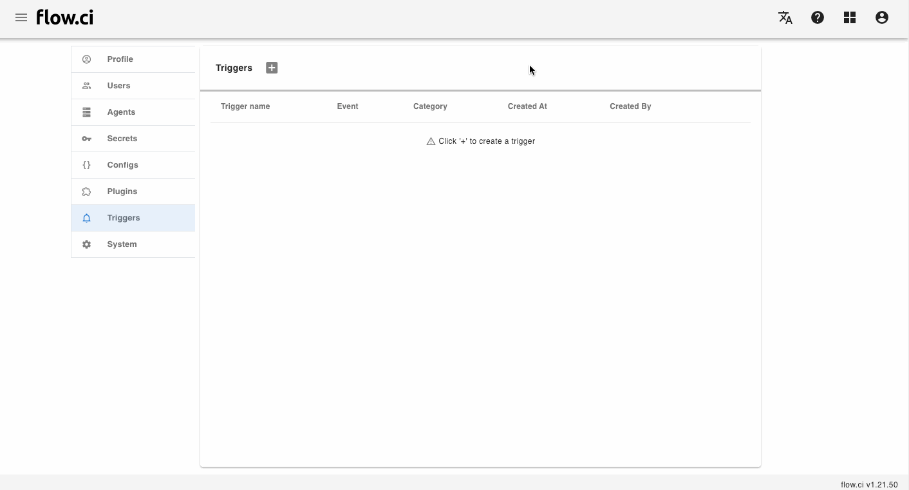
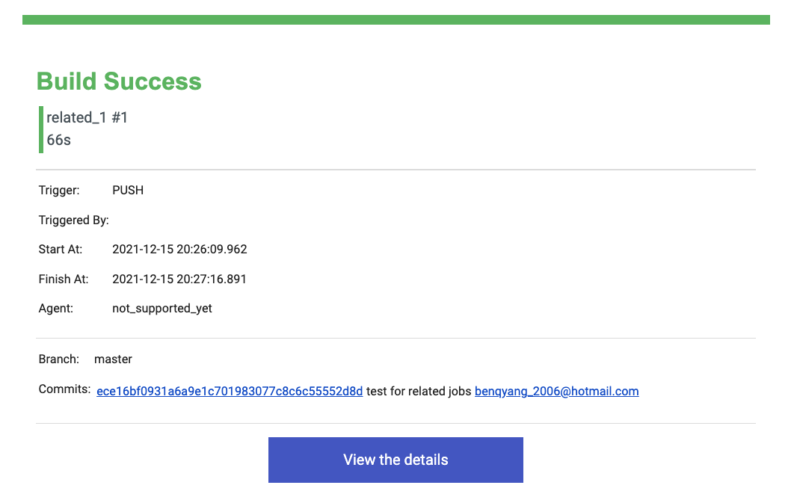

# 任务结束 `OnJobFinish` 事件

## 配置 `Email` 触发器

当任务结束时，可以 __发送邮件__ 通知给相应的用户

1. 点击 `Settings` -> `Triggers` -> `+`
2. 输入一个名称
3. 选择 `On Job Finish` 事件
4. 选择 `Email` 类型的触发器
5. 设置邮件相关参数
   - 选择 `SMTP` 配置
   - 输入邮件标题, 标题可以使用环境变量 `[[${变量名称}]]`
     * 例如: 在标题中使用 工作流名称 及 任务编号 `工作流 [[${FLOWCI_FLOW_NAME}]] 任务 [[${FLOWCI_JOB_BUILD_NUM}]] 报告`
     * 可以参考 [环境变量列表](cn/agents/vars.md) 来定义邮件标题 
   - 输入发件人地址 (如果为空，发件人为 `SMTP` 配置的地址)
   - 输入收件人地址 / 或选择 `To all flow users` 则收件人为所有工作流的用户地址
6. 保存 `Save`

邮件事例:

## 配置 `Webhook` 触发器

当任务结束时，可以根据配置发送 __HTTP 请求__ 