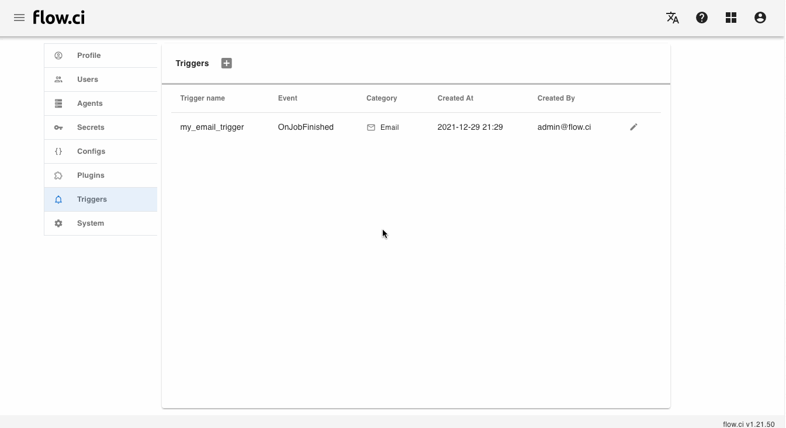

# 任务结束 `OnJobFinish` 事件

此类事件可以定义 __当任务结束时__ 的行为

## 发送邮件

可以 __发送邮件__ 通知给相应的用户

1. 点击 `Settings` -> `Triggers` -> `+`
2. 输入一个名称
3. 选择 `On Job Finish` 事件
4. 选择 `Email` 类型的触发器
5. 设置邮件相关参数
   - 选择 `SMTP` 配置
   - 输入邮件标题, 标题可以使用环境变量 `[[${变量名称}]]`
     * 例如: 在标题中使用 工作流名称 及 任务编号 `工作流 [[${FLOWCI_FLOW_NAME}]] 任务 [[${FLOWCI_JOB_BUILD_NUM}]] 报告`
     * 可以参考 [环境变量列表](cn/agents/vars.md) 来定义邮件标题 
   - 输入发件人地址 (如果为空，发件人为 `SMTP` 配置的地址)
   - 输入收件人地址 / 或选择 `To all flow users` 则收件人为所有工作流的用户地址
6. 保存 `Save`


配置成功后，当任务结束时会发送如下邮件:


## 发送 HTTP 请求

可以根据配置发送 __HTTP 请求__ 

1. 点击 `Settings` -> `Triggers` -> `+`
2. 输入一个名称
3. 选择 `On Job Finish` 事件
4. 选择 `Webhook` 类型的触发器
5. 设置相关参数
   - 输入 `URL`
   - 选择 `HTTP 方法`
   - 请求参数
     * `Params`
     * `Headers`
     * `Body`: 可以使用[环境变量](cn/agents/vars.md)，例如
       ```json
        {
          "channel": "ID",
          "text": "[[${FLOWCI_FLOW_NAME}]] #[[${FLOWCI_JOB_BUILD_NUM}]] is [[${FLOWCI_JOB_STATUS}]] at [[${FLOWCI_JOB_URL}]]"
        }
       ```
6. 保存 `Save`



例如: 如果正确配置了 Slack 发送消息的请求，当任务完成后，会发送所对应的消息到 Slack 频道中

