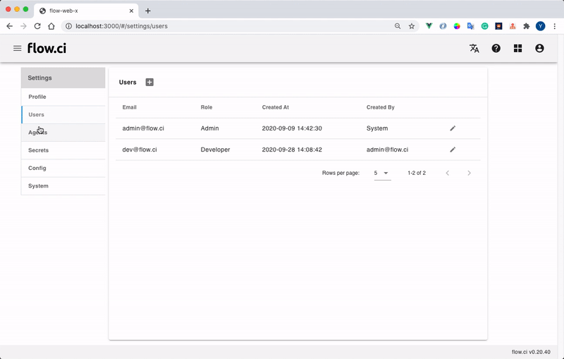

# Dynamic Agent - K8s Cluster

Another way to setup agent is config hosts on ci server, and then flow.ci will create and manage agent by k8s pod automatically.


## Create a host

* Click `Settings` -> `Agents` -> `+`
* Select `Host with auth agent`
* Specify unique host name
* Specify tag (optional)

    Agent tag is used for flow which has `selector` configuration in YAML, that means the flow job runs only on the agent with matched tags.

    For example, if YAML specified `selector` like the following, so that job will runs only on Agents with tag `ios`.

    ```yaml
    selector:
      label:
        - ios
    ```

* Fill in host detail
  * Namespace: namespace for dynmaic agents
  * Secret: kube config secret to gain access permission for cluster. you have to create secret first and then select it here.
  * Max Pool Size: max docker agents will be run in the cluster

* Click `Save`

    The host will be shown on the list

