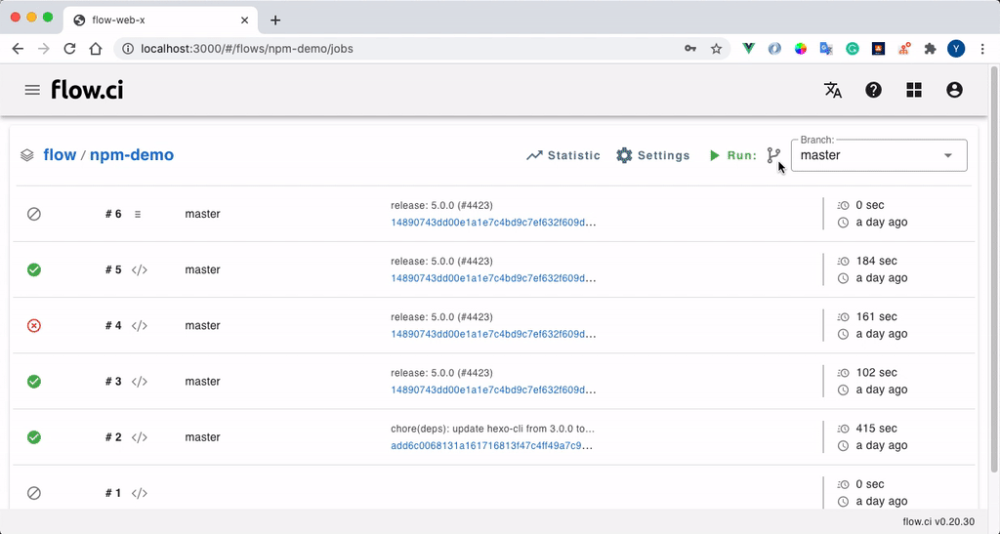

# Manual Agent

Agent is the application to run jobs, you have to create an Agent and start it before job started.

> if installed from [docker-install](https://github.com/FlowCI/docker-install.git) repo, there are default dynamic Agent configuread locally, which means you can start build without agent setup.

## Create an Agent from admin page

* Click `Settings` -> `Agents` -> `+`
* Select `Manual agent`
* Specify unique agent name
* Specify tag (optional)

    Agent tag is used for flow which has `selector` configuration in YAML, that means the flow job runs only on the agent with matched tags.

    For example, if YAML specified `selector` like the following, so that job will runs only on Agents with tag `ios`.

    ```yaml
    selector:
      label:
        - ios
    ```

* Click `Save`

    The created agent will be shown on the list



## Start Agent

The latest agent version can be found from [here](https://github.com/FlowCI/flow-agent-x/releases)

> Python environment:
>
> Some of plugins require `flowci` python lib.
>
> if you start agent from `Linux`, `Mac` or `Windows`, please install `python3` environment and python lib `pip install python-lib-flow.ci`

Start agent require the flowing arguments:

> `<ci_server_url>`: the flow.ci server url. ex: http://192.168.0.104:8080
>
> `<agent_token>`: the token copied from admin page

### Docker

The most easiest way is start agent from [docker-install](https://github.com/flowci/docker-install) repo by run `./agent.sh` script.

Or start from the following script, and replace the value of `FLOWCI_SERVER_URL` and `FLOWCI_AGENT_TOKEN`

```bash
docker run -it \
-e FLOWCI_SERVER_URL=<ci_server_url> \
-e FLOWCI_AGENT_TOKEN=<agent_token> \
-e FLOWCI_AGENT_VOLUMES="name=pyenv,dest=/ci/python,script=init.sh,image=flowci/pyenv,init=init-pyenv-volume.sh" \
-v /var/run/docker.sock:/var/run/docker.sock \
flowci/agent
```

### Linux

Replace `<ci_server_url>` & `<agent_token>` and run the following Bash in terminal

```bash
wget https://github.com/FlowCI/flow-agent-x/releases/download/v0.20.45/flow-agent-x-linux
chmod +x flow-agent-x-linux
./flow-agent-x-linux -u <ci_server_url> -t <agent_token> -m name=pyenv,dest=/ci/python,script=init.sh,image=flowci/pyenv,init=init-pyenv-volume.sh
```

### MacOS

Replace `<ci_server_url>` & `<agent_token>` and run the following Bash in terminal

```bash
wget https://github.com/FlowCI/flow-agent-x/releases/download/v0.20.45/flow-agent-x-mac
chmod +x flow-agent-x-mac
./flow-agent-x-mac -u <ci_server_url> -t <agent_token> -m name=pyenv,dest=/ci/python,script=init.sh,image=flowci/pyenv,init=init-pyenv-volume.sh
```

### Windows (x64)

Replace `<ci_server_url>` & `<agent_token>` and run the following PowerShell in terminal

```powershell
Invoke-WebRequest https://github.com/FlowCI/flow-agent-x/releases/download/v0.20.45/flow-agent-x-win -OutFile flow-agent-x-win.exe
.\flow-agent-x-linux -u <ci_server_url> -t <agent_token> -m name=pyenv,dest=/ci/python,script=init.sh,image=flowci/pyenv,init=init-pyenv-volume.sh
```

