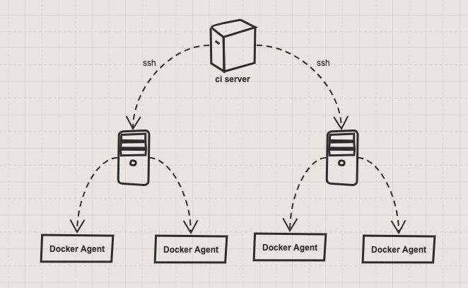
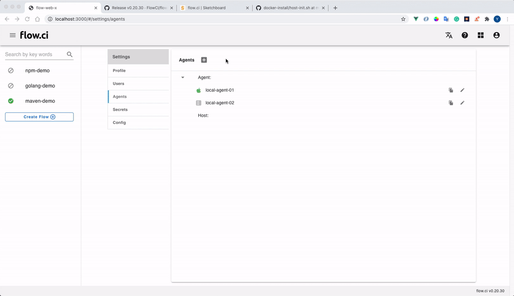

# Auto Setup Agent

Another way to setup agent is config hosts on ci server, and then flow.ci will create and manage agent by docker on the host automatically.

## Introduction

Setup host with ssh credential, ci server could scaling agent on hosts



## 1. Create a host

* Click `Settings` -> `Agents` -> `+`
* Select `Host with auth agent`
* Specify unique host name
* Specify tag (optional)

    Agent tag is used for flow which has `selector` configuration in YAML, that means the flow job runs only on the agent with matched tags.

    For example, if YAML specified `selector` like the following, so that job will runs only on Agents with tag `ios`.

    ```yaml
    selector:
      label:
        - ios
    ```

* Fill in host detail
  * Secret: to gain access permission in the host, you have to create `ssh key` secret, and copy the public key to `.ssh/authorized_keys` in the host

  * User: host username

  * IP: host ip address

  * Max Pool Size: max docker agents will be run in the host

* Click `Save`

    The host will be shown on the list



## 2. Setup the host

* Copy public key into `.ssh/authorzied_keys`

* Run [init script](https://github.com/FlowCI/docker-install/blob/master/host-init.sh) in the host, to steup required docker environment

* Test connection

