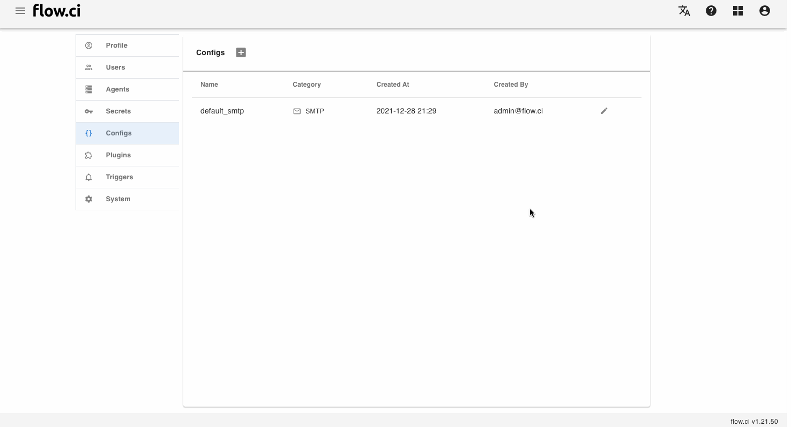

# Free text Config

## Create

1. Click `Settings` -> `Config` -> `+`
2. Enter a Config name
3. Select `Text` in category field
4. Type configuration data
5. Save




## How to

- Access `Free Text` Config from script

  For example: customize Maven `settings.xml` in .m2 directory, you can type XML configuration from text field

  ```xml
  <settings>
    <proxies>
       <proxy>
          ...
       </proxy>
    </proxies>
  </settings>
  ```

  Apply `configs` and type Config name from step YAML

  ```yaml
  steps:
  - name: set maven settings
    configs:
    - my_xml_config
    bash: |
      echo ${my_xml_config}
      echo ${my_xml_config} > ~/.m2/settings.xml
  ```
