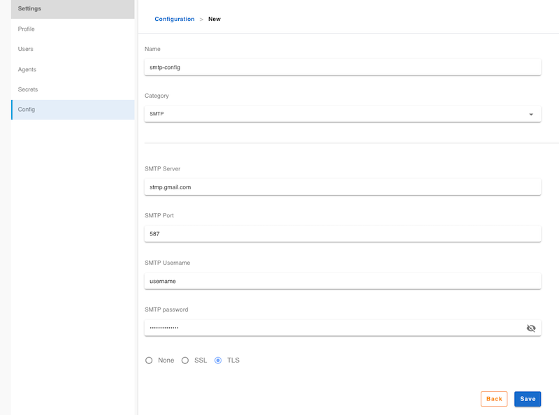

# SMTP Config

SMTP server configuration that can be applied in the plugins

## Create a SMTP Config

Click `Settings` -> `Config` -> `+`

1. Enter a config name
2. Select `SMTP` in category field
3. Type detail settings (server, port, username, password and security setting)
4. save



## How to use it

Some of the plugins need SMTP configuration to send email, for example [email-notify](https://github.com/flowci-plugins/email-notify) plugin, it requires a SMTP config for sending email report, it's pretty easy to use the config by type the name your typied.

```yml
notifications:
  - plugin: 'email-notify'
    envs:
      FLOWCI_SMTP_CONFIG: "sendgrid-demo" # SMTP Config name
      FLOWCI_EMAIL_FROM: "flow.ci.test@gmail.com"
```
