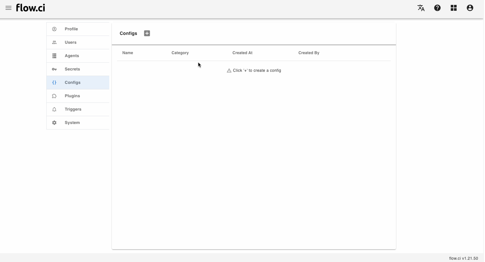
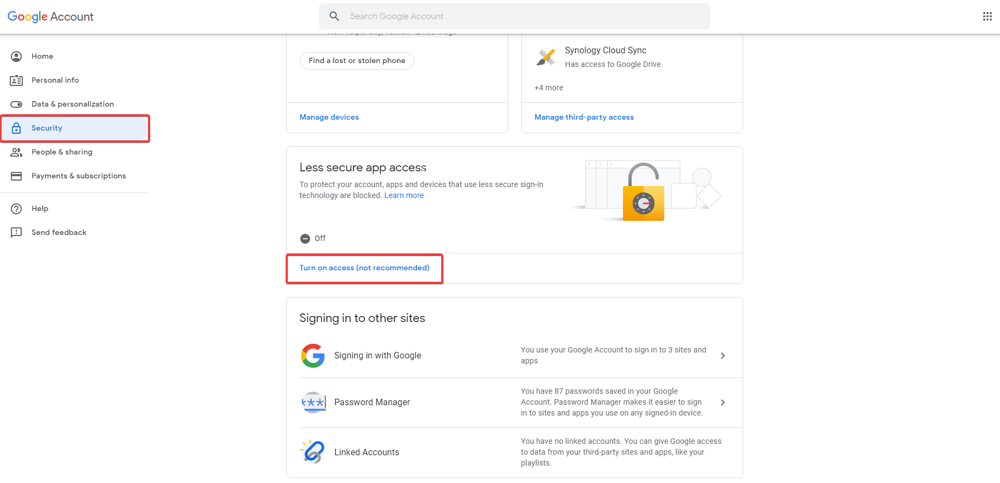

# SMTP Config

## Create

1. Click `Settings` -> `Config` -> `+`
2. Enter Config name
2. Select `SMTP` in category field
3. Type required data:
   - `Server`
   - `Port`
   - `Username`
   - `Password`
   - Select encryption type: `None`, `SSL` or `TLS`
4. Save



## How to

- Access `SMTP` Config from script

  It can be accessed from script if the `configs` has beed defined in `step` YAML

  ```yaml
  steps:
  - name: smtp config demo
    configs:
    - default_smtp
    bash: |
      echo ${default_smtp_SERVER}
      echo ${default_smtp_PORT}
      echo ${default_smtp_SECURE_TYPE}
      echo ${default_smtp_AUTH_USERNAME}
      echo ${default_smtp_AUTH_PASSWORD}
  ```

- Apply `SMTP` Config in Trigger

  For example, send job notification email with Gmail:

  - `Server`: stmp.gmail.com
  - `Port`: 587
  - `Username`: Gmail username
  - `Password`: Gmail password
  - Select `TLS`

  Also need to modify Gmail security setting:

  - Login to Gmail
  - Find `Security > Less secure app access`
  - Click `Turn on access`

  
  

  About how to setup email trigger, please refer [Email Trigger](en/trigger/email.md)
