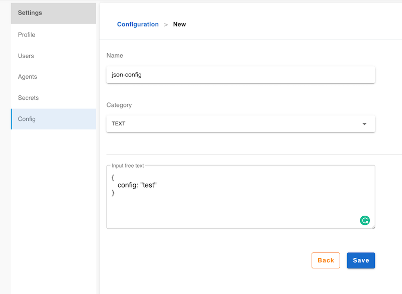

# Text Config

Text config that can be applied in the plugins that needs to load configuration from server,
the content is free text, it could be json, yaml or any format.

## Create a Text Config

Click `Settings` -> `Config` -> `+`

1. Enter a config name
2. Select `TEXT` in category field
3. Type content
4. save

