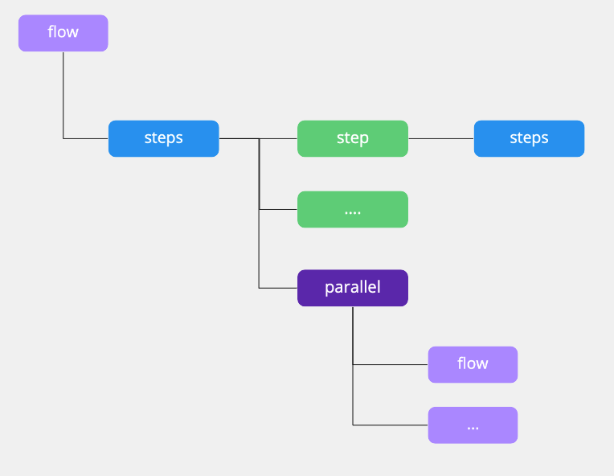
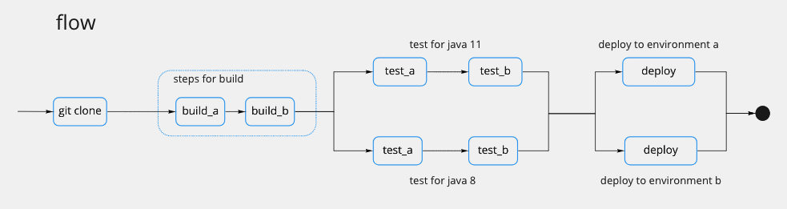

# Flow Structure

Flow is the top-level component of flow.ci for CI/CD or other kinds of job

The basic elements of flow include:
- steps
- step
- parallel



### Let's make an example!


Clone the code from git repo, run test for both Java 8 and 11, and then deploy to two environments.





Repersent the above diagram by YAML

```yaml

steps:
  - name: git clone
    bash: |
      echo "run git clone"

  - name: steps for build
    docker:
      image: "my build image"
    steps:
      - name: build_a
        bash: |
          echo "run build step a"
      - name: build_b
        bash: |
          echo "run build step b"
  
  - parallel:
      java_8_test:
        docker:
          image: "java 8 image"
        steps:
          - name: test a
            bash: |
              echo "run test a for java 8"
          - name: test b
            bash: |
              echo "run test b for java 8"

      java_11_test:
        docker:
          image: "java 11 image"
        steps:
          - name: test a
            bash: |
              echo "run test a for java 11"
          - name: test b
            bash: |
              echo "run test b for java 11"


  - parallel:
      deploy_to_a:
        steps:
          - name: deploy
            bash: |
              echo "deploy to environment a"

      deploy_to_b:
        steps:
          - name: deploy
            bash: |
              echo "deploy to environment b"

```

For more YAML configuration, please refer [YAML Reference](/en/yml/reference_v1)