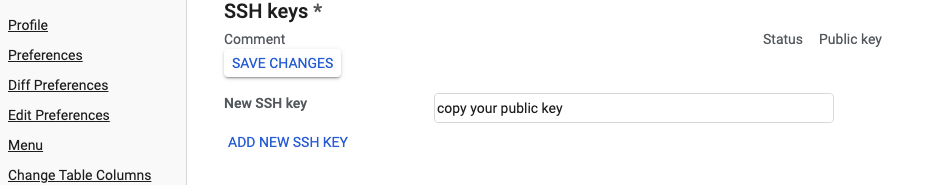
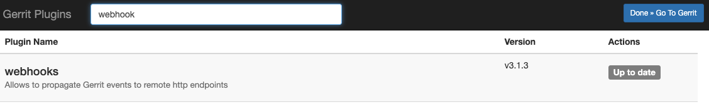
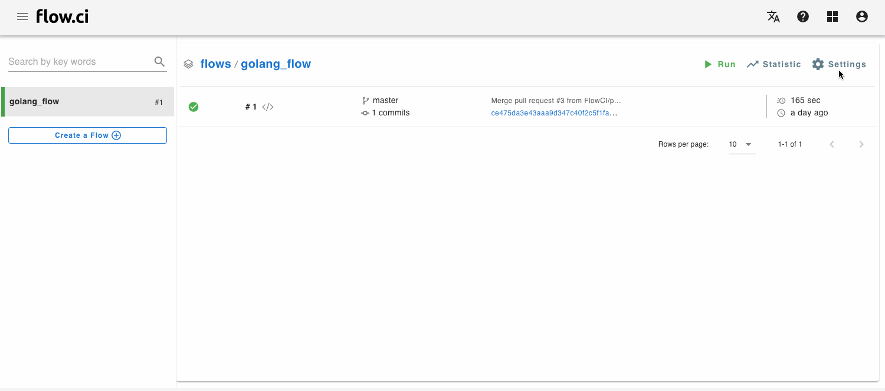
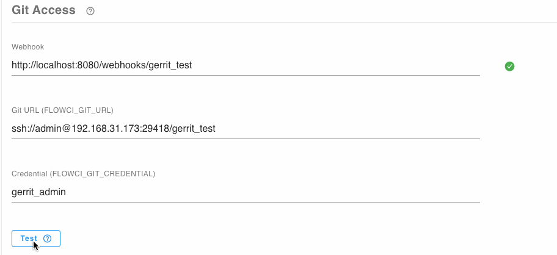

# Gerrit Configuration

## Setup Access Permission for Private Repo

Copy `public key` from flow.ci secret page

Open Gerrit and add it from `{your_gerrit_host}/settings/#SSHKeys` to your account. (make sure the accout has access right to git repo)



## Setup Webhook

Webhook is a way of how to trigger CI job from Gerrit.

1. Make sure the [webhook plugin](https://gerrit.googlesource.com/plugins/webhooks/) is installed in the Gerrit, you could install it from Gerrit plugin manager.

    


2. Go into the local git repo folder which is cloned from Gerrit, and checkout `meta/config` branch

    ```bash
    git fetch origin refs/meta/config:refs/remotes/origin/meta/config
    git checkout meta/config
    ```

3. Copy webhook url from flow settings
    > Hint: Your host must be exposed to internet (public ip or domain), otherwide the GitHub events can not be received.
    > If pulbic ip or domain not availble in your environments, please use the tools like [ngrok](https://ngrok.com/).  

   


4. Add the following to `webhooks.config` file (create the file if not existed)

    > flow.ci only support `patchset-created` gerrit event currently

    ```
    [remote "flowci_pathset_created"]
        url = {the url copied from step 3}
        maxTries = 1
        sslVerify = false
        event = patchset-created
    ```

5. Push the change to `meta/config` branch

    ```
    git push origin meta/config:meta/config
    ```


## Verify Gerrit Settings

- Verify permission for repo:

  Test the access right from flow settings by click 'test' button, the green will be shown if everything correct.
  
  

## Setup Access permission to Write Job Status to Gerrit