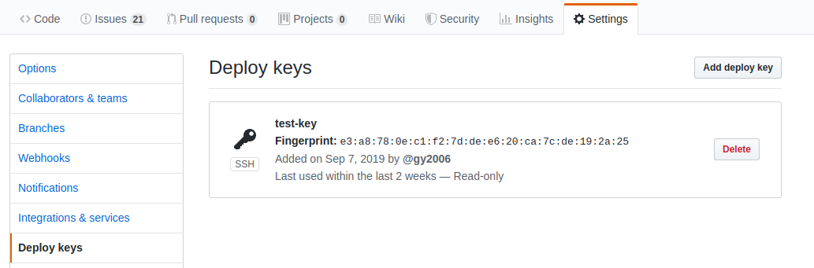
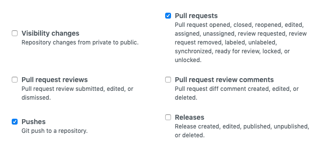

# GitHub Configuration

## Setup Access Permission

Copy `public key` from admin page, open GitHub repo web and add it from `Settings > Deploy key` for single repo access. GitHub not allowed to add same public key for muliple repositories, we recommend to have a special 'CI user' to manage single public key access: [adding new ssh key to your GitHub account](https://help.github.com/en/articles/adding-a-new-ssh-key-to-your-github-account).

## Setup Webhook

The webhook used for receive git notification such as push, tag, pull request and so on.

1. Copy webhook url from flow settings
    > Hint: Your host must be exposed to internet (public ip or domain), otherwide the GitHub events can not be received.
    > If pulbic ip or domain not availble in your environments, please use the tools like [ngrok](https://ngrok.com/).  

   

2. Setup webhook

- Payload URL

  Paste webhook url copied from flow settings (step 1)

  > If using `ngrok`, please replace wehbook url by ngrok, ex: `http://172.20.10.4/webhooks/spring-sample` to `http://7e9ea9dc.ngrok.io/webhooks/spring-sample`

- Content type

  Select content type to `application/json`

  

- Select events

  - Select `Let me select individual events`
  - Check events `push` and `pull request`

  

## Verify GitHub Settings

- Webhook:

  The green check box will be shown after 'webhook' field if the flow receive the 'ping' request after GitHub webhook created.

- Deploy Key:
  
  Test the access right from flow settings by click 'test' button, the green will be shown if everything correct.

  