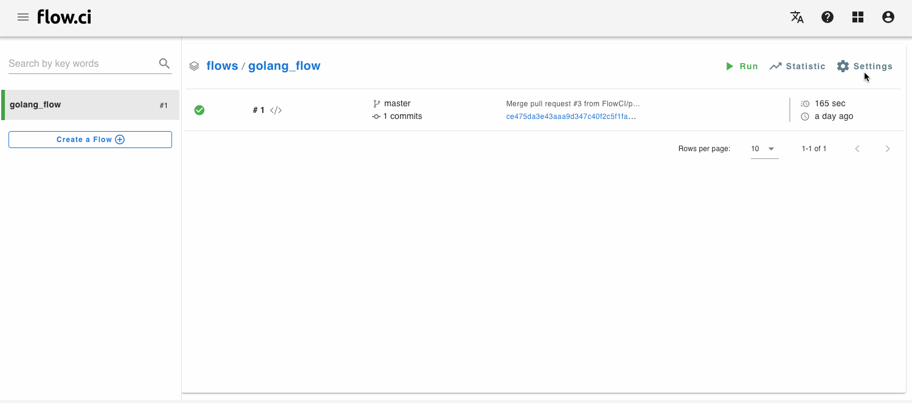

# GitLab Integration

## Setup Access Permission for Private Repo

Copy `public key` from admin page, open GitLab repo web and add it from `Settings > Repository -> Deploy Keys` for single repo access. GitLab not allowed to add same public key for muliple repositories, we recommend to have a special 'CI user' to manage single public key access

## Setup Webhook

The webhook used for receive git notification such as push, tag, pull request and so on.

1. Copy webhook url from flow settings
    > Hint: Your host must be exposed to internet (public ip or domain), otherwide the gitlab events can not be received.
    > If pulbic ip or domain not availble in your environments, please use the tools like [ngrok](https://ngrok.com/).  

   

2. Setup webhook

- URL
  
  Paste webhook url copied from flow settings (step 1)

  > If using `ngrok`, please replace wehbook url by ngrok, ex: `http://172.20.10.4/webhooks/spring-sample` to `http://7e9ea9dc.ngrok.io/webhooks/spring-sample`

- Select events
  
  Check events `Push events`, `Tag push events` and `Merge request events`
  
  

## Verify GitLab Settings

- Permission for repo:
  
  Test the access right from flow settings by click 'test' button, the green will be shown if everything correct.

  

## Setup Access permission to Write Job Status to GitHub

1. Create a Token

    In order to have permission for writing job status back to GitLab, we need to create a token with `api` permission from https://gitlab.com/-/profile/personal_access_tokens (replace `https://gitlab.com` to your own GitLab host when access private gitlab)

    

2. Add GitLab Token to flow.ci Secret

    Open the secret settings page `Settings -> Secret -> +` , paste the token copied from GitLab and save

    

3. Link to GitLab

    Open the git connection page `Settings -> Git -> +`, select `GitLab` on git source, input your GitLab host address, and then select a secret created on the last step

    

4. GitLab commit status

    After the configuration, the correspond commit status will be updated after job finished.

    