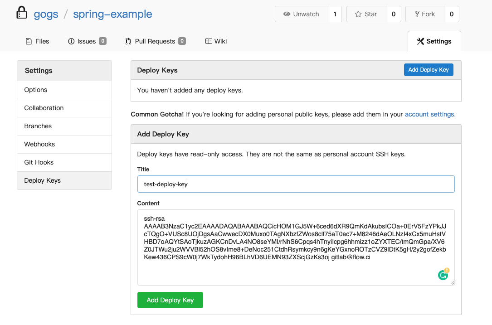
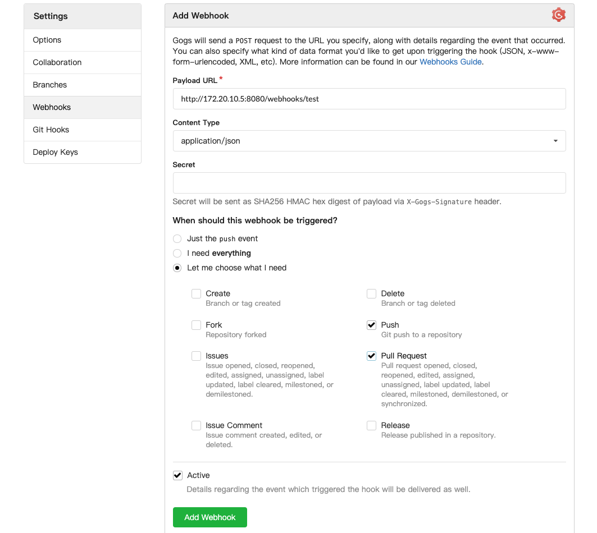
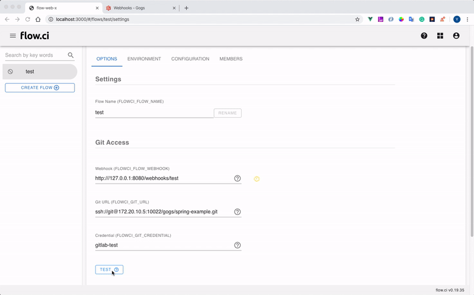

# Gogs Configuration

## Setup Access Permission

Copy `public key` from admin page, open Gogs repo web and add it from `Settings > Deploy Keys` for single repo access. Gogs not allowed to add same public key for muliple repositories, we recommend to have a special 'CI user' to manage single public key access

## Setup Webhook

The webhook used for receive git notification such as push, tag, pull request and so on.

1. Copy webhook url from flow settings
    > Hint: Your host must be exposed to internet (public ip or domain), otherwide the gogs events can not be received.
    > If pulbic ip or domain not availble in your environments, please use the tools like [ngrok](https://ngrok.com/).  

   

2. Setup webhook

- Playload URL
  
  Paste webhook url copied from flow settings (step 1), and select `application/json` as content type

  > If using `ngrok`, please replace wehbook url by ngrok, ex: `http://172.20.10.5/webhooks/spring-sample` to `http://7e9ea9dc.ngrok.io/webhooks/spring-sample`

- Select events
  
  Check events `Push` and `Pull Request`
  
  

## Verify Gogs Settings

- Deploy Key:
  
  Test the access right from flow settings by click 'test' button, the green will be shown if everything correct.

  