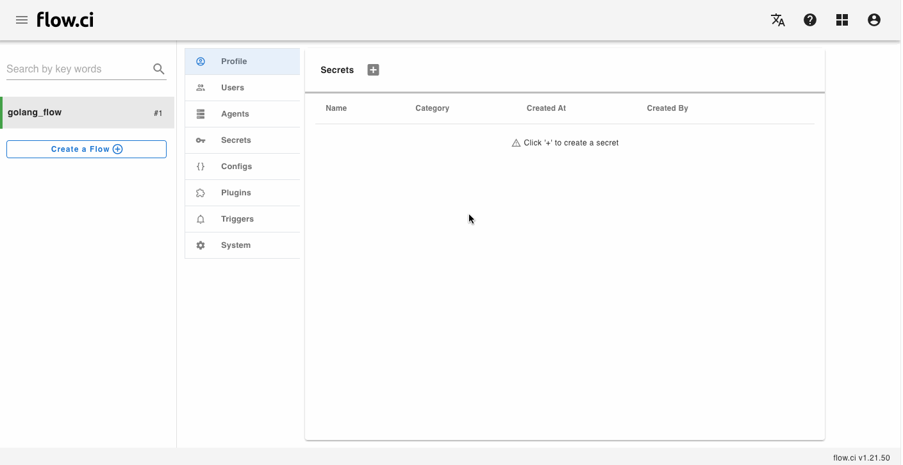

# Git setup

## YAML setup

flow.ci clones git repo via [git clone](https://github.com/flowci-plugins/gitclone) plugin

```yaml
envs:
  FLOWCI_GIT_URL: "https://github.com/FlowCI/spring-petclinic-sample.git" ## Git repo address, support https or ssh

steps:
- name: clone
  docker:
    image: flowci/debian-git ## other images with git command can be applied here as well!
  plugin: 'gitclone'
```


## Git repo access permission

The __SSH-RSA__ `secret` is required if git url is __SSH__ based, for example `git@github.com:FlowCI/docs.git`

1. Create SSH-RSA secret

   - Go to `Settings -> Secret -> +` from Admin page
   - Input a secret name, for example `ras-test`
   - Select `SSH key` category
   - Click `create a new` ssh key pair or paste exsiting public and private key
   - Save

    

2. Config secret in the flow

   `FLOWCI_GIT_CREDENTIAL` variable is applied for git access permisison in [Git clone plugin](https://github.com/flowci-plugins/gitclone). 
   
   For example:

   ```yaml
    envs:
      FLOWCI_GIT_CREDENTIAL: "rsa-test"

    steps:
    - name: clone
      docker:
        image: flowci/debian-git
      plugin: 'gitclone'
   ```

## Setup Git provider

Different Git provider has different way to setup webhook, ssh permission and events.

flow.ci currenlty supports:

- [GitHub](en/git/github.md)
- [GitLab](en/git/gitlab.md)
- [Gogs](en/git/gogs.md)
- [Gitee](en/git/gitee.md)

please click around the links for more detail
