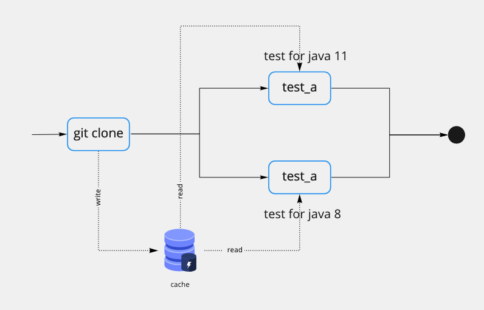
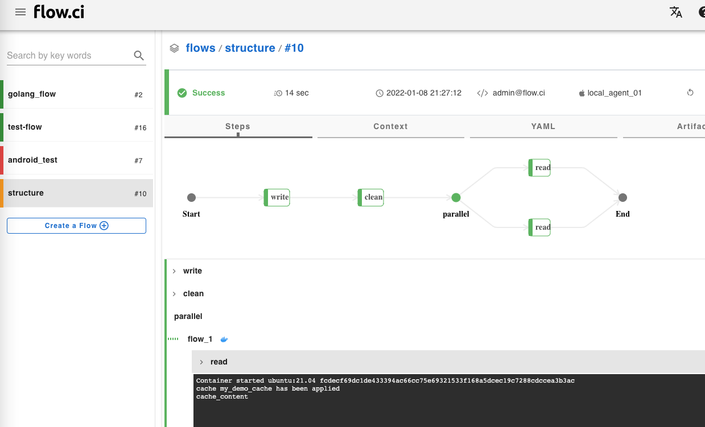

# Cache

The job cache is needed when steps run on different Agents and steps want to access the data from previous steps.



## How to use Cache

The `cache` could be used in a `step`. The `key` is required to define cache name, `paths` is needed to write data.

```yaml
steps:
  - name: write
    cache:
      key: mycache
      paths:
        - "./my_demo_cache"
    bash: |
      mkdir -p ./my_demo_cache
      echo "cache_content" > ./my_demo_cache/my_file

  - name: clean
    bash: |
      # Delete dir from worksapce, to make sure cache is loaded not from locally.
      rm -rf ./my_demo_cache

  - parallel:
      flow_1:
        docker:
          image: "ubuntu:21.04"
        steps:
        - name: read
          cache:
            key: mycache 
          bash: |
            cat ./my_demo_cache/my_file

      flow_2:
        docker:
          image: "ubuntu:18.04"
        steps:
        - name: read
          cache:
            key: mycache 
          bash: |
            cat ./my_demo_cache/my_file

```

The executed result like:

