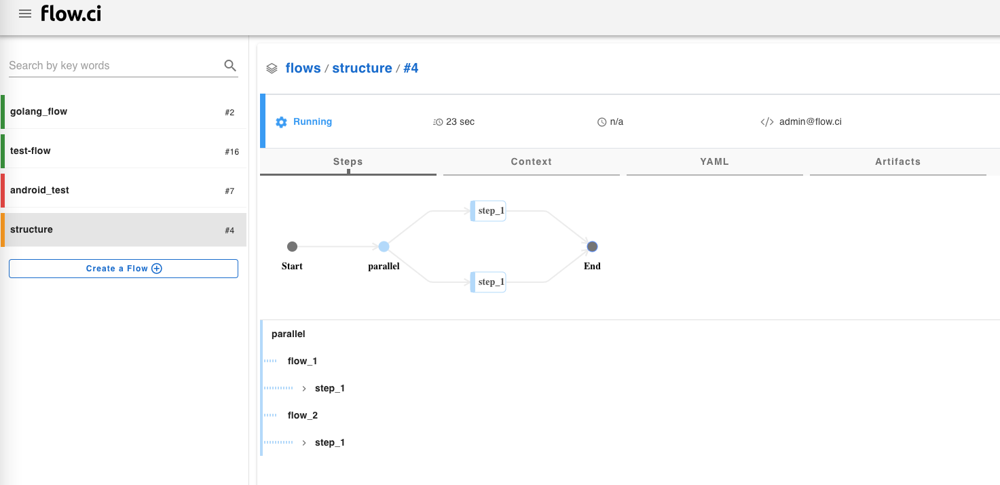

# Parallel

Running steps parallelly could speed up the performance of the job.

The multiple flows are supported in the `parallel`.

Multiple idle Agents are required for parallel steps, the steps will run sequentially if only ONE idle agent available.

```yaml
steps:
- parallel:
    flow_1: ## parallel flow name
      steps:
      - name: step_1
        bash: |
          echo "step 1 from flow 1"
            
    flow_2: ## parallel flow name
      steps:
      - name: step_1
        bash: |
          echo "step 1 from flow 2"

```



Example: to run system test on both `java 8` and `java 11` environment.

```yaml
steps:
- name: git clone
  bash: |
    echo "run git clone"

- parallel:
    java_8_test:
      docker:
        image: "java 8 image"
      steps:
        - name: test a
          bash: |
            echo "run test a for java 8"
        - name: test b
          bash: |
            echo "run test b for java 8"

    java_11_test:
      docker:
        image: "java 11 image"
      steps:
        - name: test a
          bash: |
            echo "run test a for java 11"
        - name: test b
          bash: |
            echo "run test b for java 11"
```