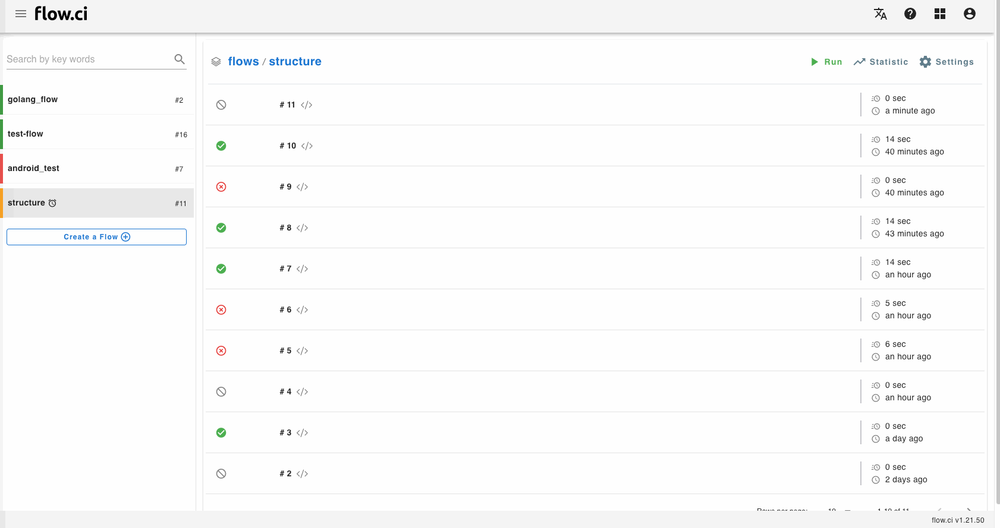

# Interactive Web Terminals

Interactive web terminals give the user access to a terminal in step for running commands, it's only available for __admin user__.

The step will be holded unit the web terminal session exit.

```yaml
steps:
  - name: step1
    bash: |
      echo "try web terminal"
      sleep 10
```

