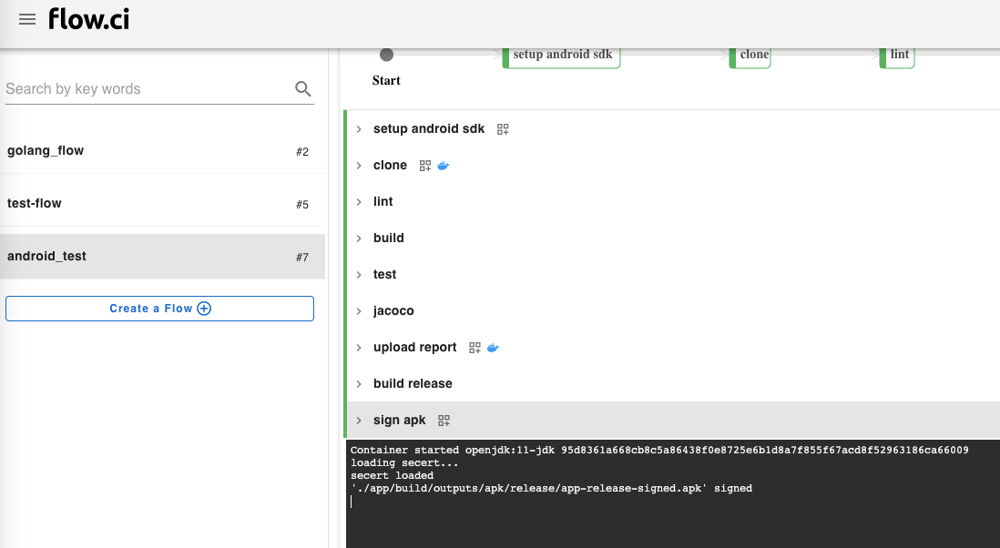

# Android Sign Secret

## Create

1. Click `Settings` -> `Secret` -> `+`
2. Enter a secret name
3. Select `Android sign` in category field
4. Input required data
   - `Key store file`
   - `key store password`
   - `Key alias`
   - `Key password`
5. Save


## How to

- [android-signing](https://github.com/flowci-plugins/android-signing) plugin: 

  Type secret name in the variable `SIGN_SECRET`

  ```yaml
    - name: sign apk
      envs:
        SIGN_FILE_PATTERN: '*-unsigned.apk'
        SIGN_SECRET: my_android_sign
      plugin: android-signing
  ```

  The output will be like `'./xx/xx/xx/you_package.apk' signed` if apk is signed

  