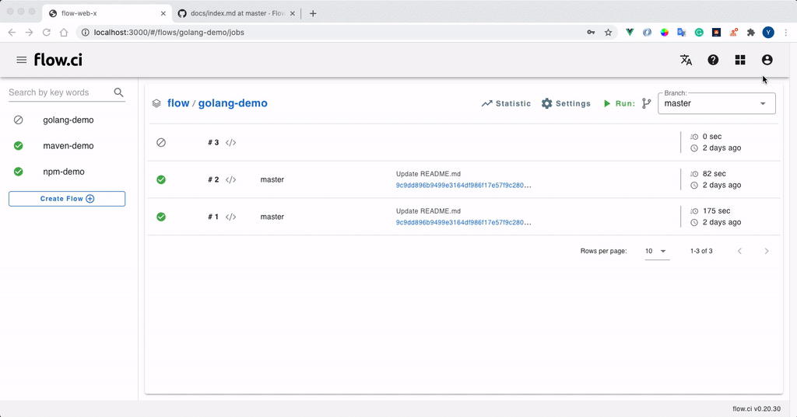

# Auth (username & password) Secret

Auth Secret repersent username and password pair.

## Create

1. Click `Settings` -> `Secret` -> `+`
2. Enter a secret name
3. Select `AUTH` in category field
4. Type username and password
5. Save



## How to

- Access `Auth` secret from script

  It can be accessed from script if the `secrets` has beed defined in `step` YAML

  ```yaml
  steps:
    - name: get auth demo
      secrets:
      - my_auth_key
      bash: |
        echo ${my_auth_key_USERNAME}
        echo ${my_auth_key_PASSWORD}
  ```
