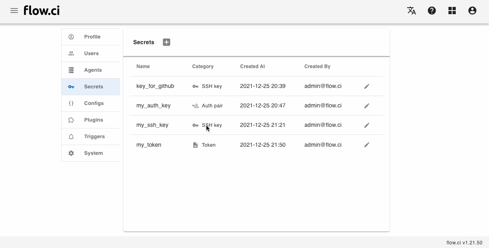

# K8s `kubeconfig` Secret

## Create

1. Click `Settings` -> `Secret` -> `+`
2. Enter a secret name
3. Select `Kubeconfig` in category field
4. Copy kubeconfig to the text field
5. Save

## How to

- Auto scaling Agent: please refer [Kubernates](en/agents/k8s_host.md#auto-scalling-on-k8s-cluster)