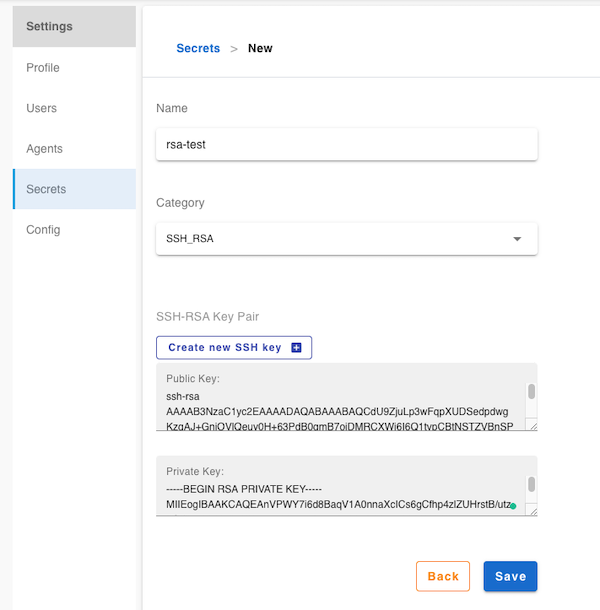

# SSH-RSA credential

## Create a ssh-rsa credential

Click `Settings` -> `Credentails` -> `+`

1. Enter a credential name
2. Select `SSH_RSA` in category field
3. new ssh-rsa key pair

    by click `CREATE NEW SSH KEY` button, it will generate new ssh-rsa key pair from current user email

    or copy-paste key pair to text box
4. save



## Configuration

Some of the plugins need credential to gain access. For example, `git-clone` plugin, it requires a ssh-rsa credential to clone the git repo, it's pretty easy to use the credential, just needs to input credential name.

```yml
envs:
  FLOWCI_GIT_URL: "https://github.com/FlowCI/spring-petclinic-sample.git"
  FLOWCI_GIT_BRANCH: "master"
  FLOWCI_GIT_REPO: "spring-petclinic"

steps:
- name: clone
  envs:
    FLOWCI_GIT_CREDENTIAL: "ssh-credential-test"
  plugin: 'gitclone'
```
