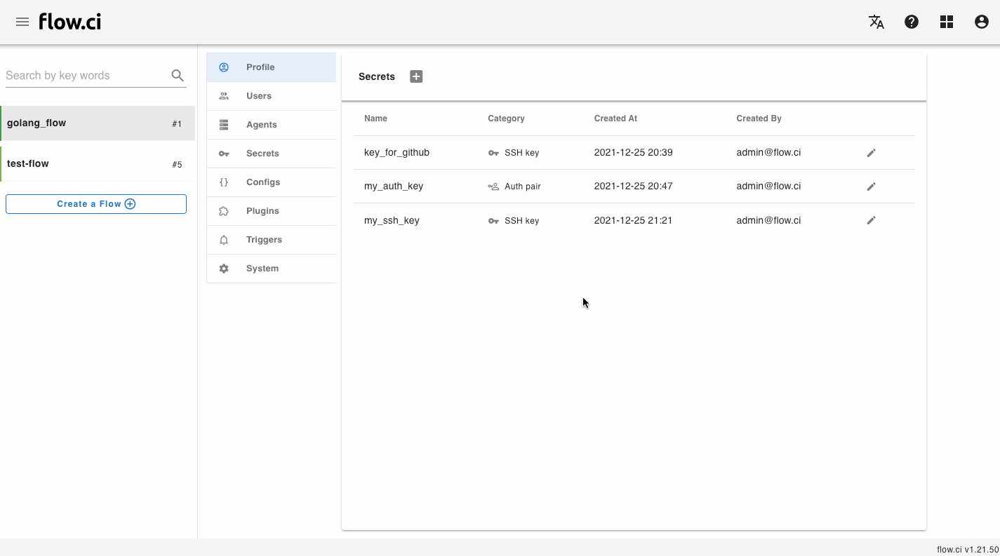

# Token Secret

## Create

1. Click `Settings` -> `Secret` -> `+`
2. Enter a secret name
3. Select `Token` in category field
4. Type token data
5. save



## How to

- Access `Token` secret from script

  It can be accessed from script if the `secrets` has beed defined from step YAML

  ```yaml
  steps:
  - name: get token demo
    secrets:
    - my_token
    bash: |
      echo ${my_token}
  ```
