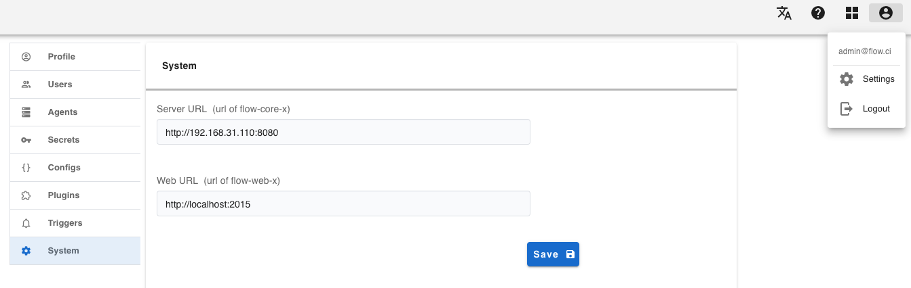
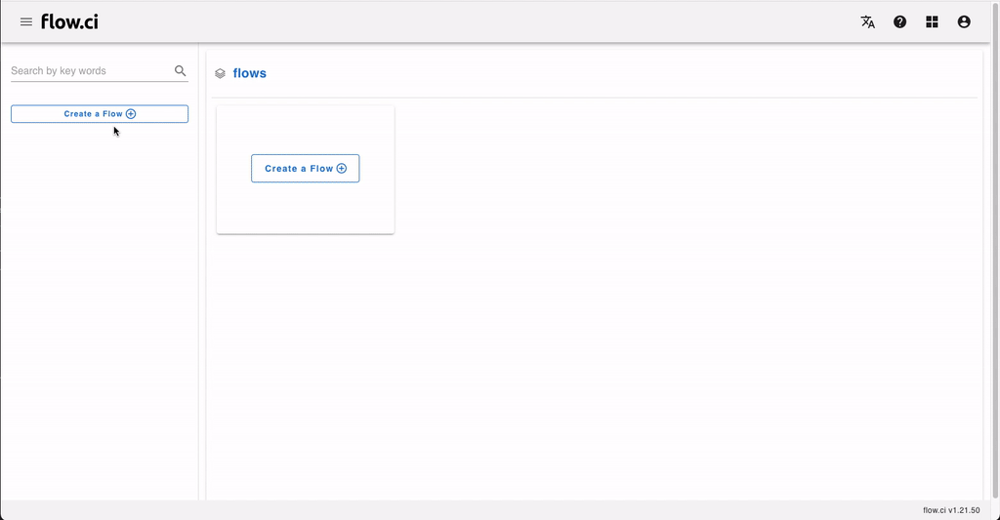
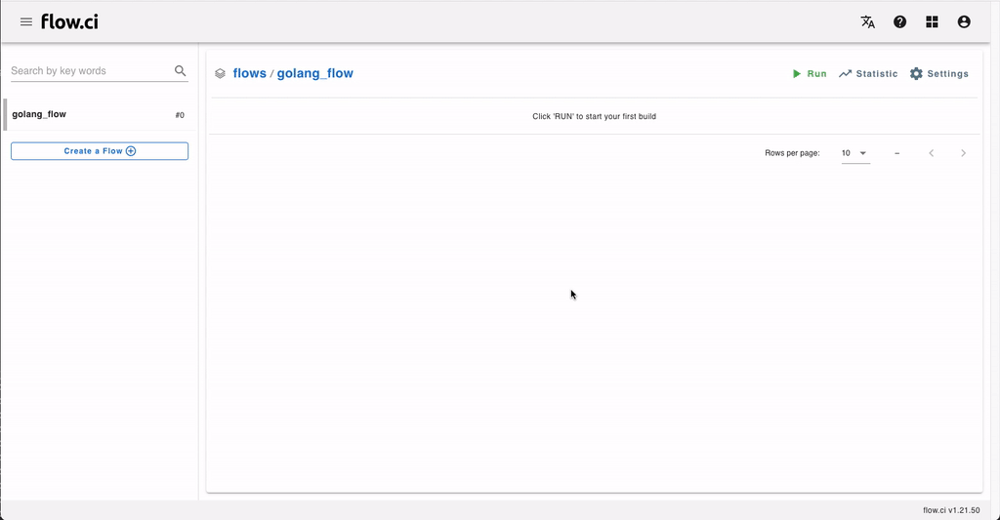

# Getting Started

## Install

> [Docker](https://docs.docker.com/install/) & [Docker-Compose](https://docs.docker.com/compose/install/) are required

To install flow.ci, just run the following script:

```bash
git clone https://github.com/FlowCI/docker.git flow-docker
cd flow-docker
./server.sh start
```

Open the link `http://localhost:2015` from web browser after installtion is finished.

> - __Port__: default port for server is `8080`, for web is `2015`. Modify the default ports from `server.sh` 及 `server.yml`
> - __IP__: It will be auto detected from `./server.sh start`, or set your IP from `./server.sh -h your_ip start` if the address cannot be found.


## Set URL

Check from `Settings -> System` `(http://{your_web_host}/#/settings/system)` to make sure the URL of server and web are correct.



## Create a flow

- Input flow name
  - Click 'create flow' button
  - Input name of flow
  
- Select YAML template




## RUN

Click `Run` button from flow page

> - Job CANNOT start when the blank template has been selected.




- Git: How to config Git repo, please refer [Git Connection](en/git/index.md)

- Agent: There are default agents on server host, to configurate more agetns, please refer [Agent](en/agents/index.md)

- Trigger: The `OnJobFinish` event will be triggered when a job is done, the __email__ or other notifications could be set up by the trigger. please refer [Trigger](cn/trigger/on_job_finish.md)
