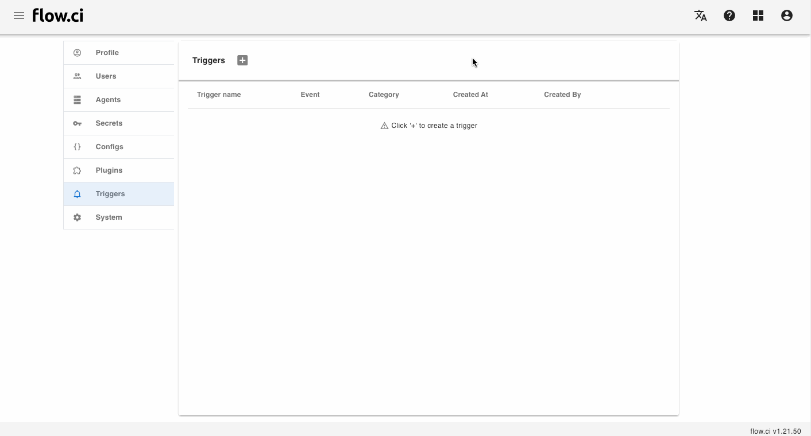
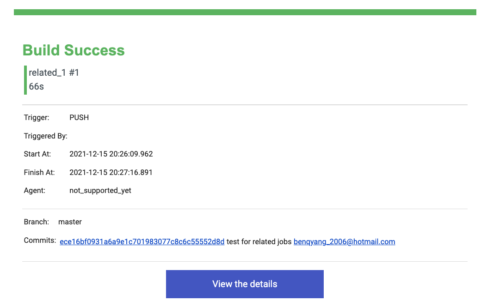
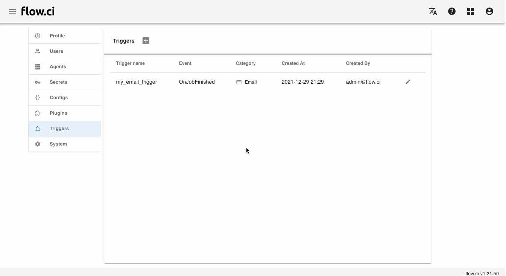
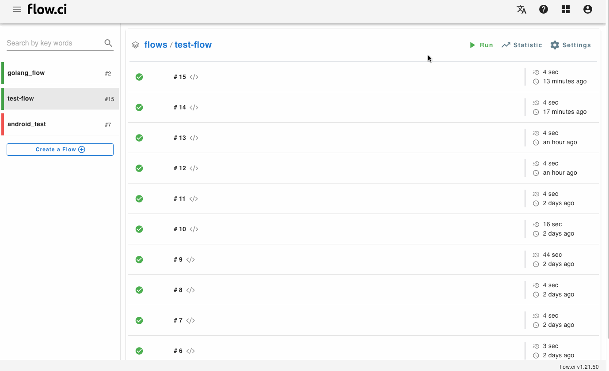

# "OnJobFinish" Event

The behavior when __job finished__ can be customized from `OnJobFinish` event 

## Send email

A __notification email__ will be sent to related users when job is finished

1. Click `Settings` -> `Triggers` -> `+`
2. Type a trigger name
3. Select `On Job Finish` event
4. Select `Email` category
5. Type email related data
   - Select a `SMTP` Config
   - Input email title, the variable can be used like `[[${variable name}]]` 
     * Example show flow name and job build number in the title: `Report of flow [[${FLOWCI_FLOW_NAME}]] on job # [[${FLOWCI_JOB_BUILD_NUM}]]`
     * For more variables, please refer [variables](en/agents/vars.md) 
   - Sender email (optional, `SMTP` username will be applied)
   - Receiver email / or select `To all flow users` to all users of related flow
6. Save



The notification email will be sent on job is finished




## Send HTTP request

A __HTTP request__ will be sent to per-defined URL when job is finished

1. Click `Settings` -> `Triggers` -> `+`
2. Type a trigger name
3. Select `On Job Finish` event
4. Select `Webhook` category
5. Type related data
   - `URL`
   - `HTTP Method`
   - Data of request
     * `Params`
     * `Headers`
     * `Body`: the variable can be used here, please refer [Variables](en/agents/vars.md), for example:
       ```json
        {
          "channel": "ID",
          "text": "[[${FLOWCI_FLOW_NAME}]] #[[${FLOWCI_JOB_BUILD_NUM}]] is [[${FLOWCI_JOB_STATUS}]] at [[${FLOWCI_JOB_URL}]]"
        }
       ```
6. Save




Example: send job finish notification to __Slack__ channle.

