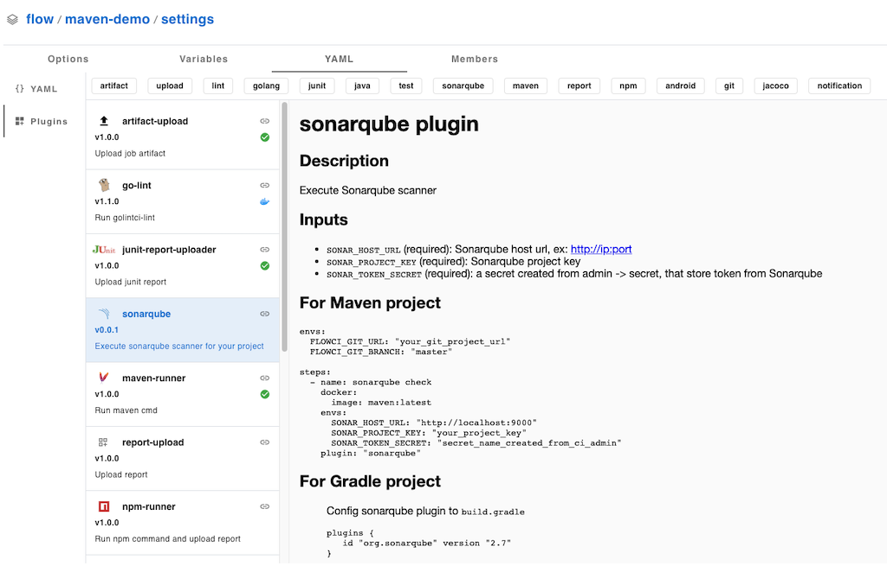

# Plugins

Apply plugin in flow.ci is very simple, it just needs type plugin name in the YAML step, for example apply `gitclone` plugin:

```yml
envs:
  FLOWCI_GIT_URL: "https://github.com/gin-gonic/gin.git"

steps:
  - name: clone
    plugin: 'gitclone'
```

All plugins list at flow `settings` -> `configuration` -> `plugins`


