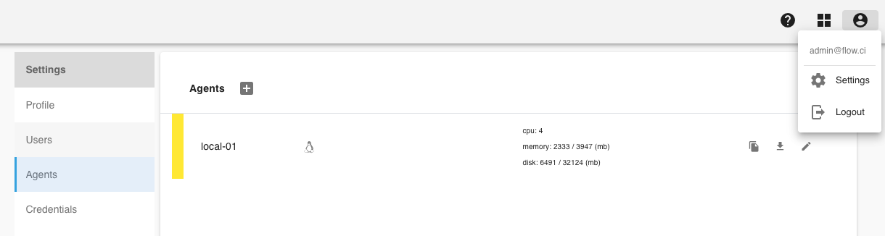
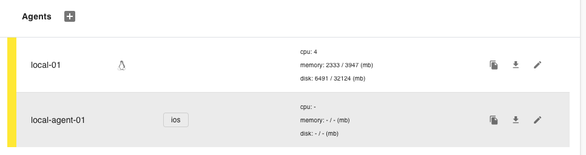

# Manual Setup Agent

Agent is the application to run flow jobs, you have to create an Agent before job started.

## 1. Create from Admin page

* Click `Settings` -> `Agents` -> `+`

    

* Specify unique agent name
* Specify tag (optional)

    Agent tag is used for flow which has `selector` configuration in YAML, that means the flow job runs only on the agent with matched tags.

    For example, if flow YAML specified `selector` like the following, so that  job will runs only on Agents with tag `ios`.

    ```yaml
    selector:
    tags:
        - ios
    ```

* Click `Save`

    The created agent will be shown on the list

    

## 2. Start Agent

The most easiest way is start agent from [flow-docker](https://github.com/flowci/docker) repo by run `./agent.sh` script.

Or from the following script, and replace the value of `FLOWCI_SERVER_URL` and `FLOWCI_AGENT_TOKEN`

```bash
docker run -it \
-e FLOWCI_SERVER_URL=http://yourhost:port \
-e FLOWCI_AGENT_TOKEN=token_copied_from_admin_page \
-v /var/run/docker.sock:/var/run/docker.sock \
flowci/agent
```
