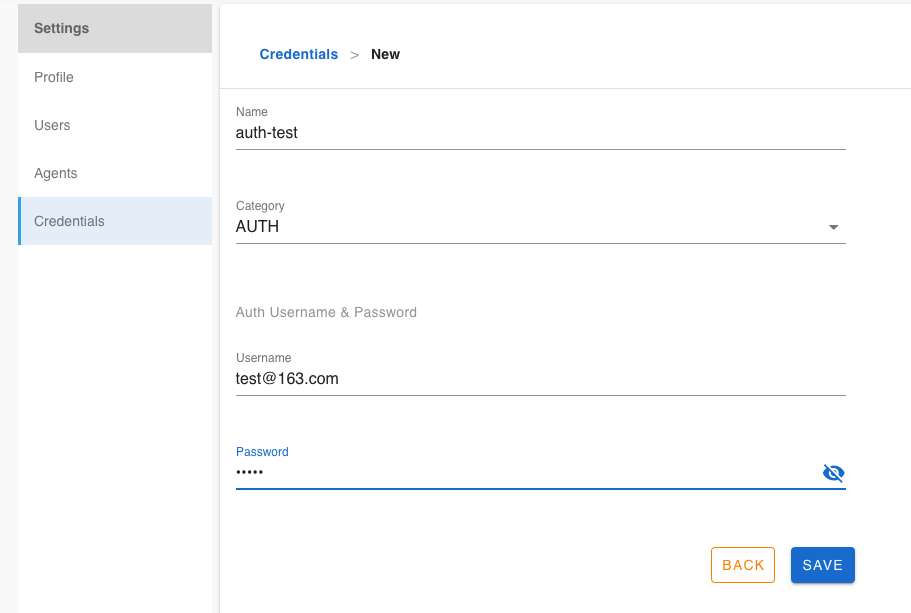

# Auth (username & password) Credential

Auth credential repersent username and password pair.

## Create an auth credential

Click `Settings` -> `Credentails` -> `+`

1. Enter a credential name
2. Select `AUTH` in category field
3. Type username and password
4. save



## Configuration

Some of the plugins need credential to gain access right, for example, `email-report` plugin, it requires a credential for smtp server, so type the credential name to plugin variable `FLOWCI_EMAIL_CREDENTIAL`.

```yml
steps:
  - name: clone
    plugin: 'gitclone'
    allow_failure: false

  - name: email result
    tail: true
    envs:
        FLOWCI_EMAIL_SMTP: "smtp.163.com"
        FLOWCI_EMAIL_SSL: true
        FLOWCI_EMAIL_FROM: "xxxx@163.com"
        FLOWCI_EMAIL_TO: "FLOW_USERS"
        FLOWCI_EMAIL_CREDENTIAL: "auth-test"
    plugin: email-report
```
