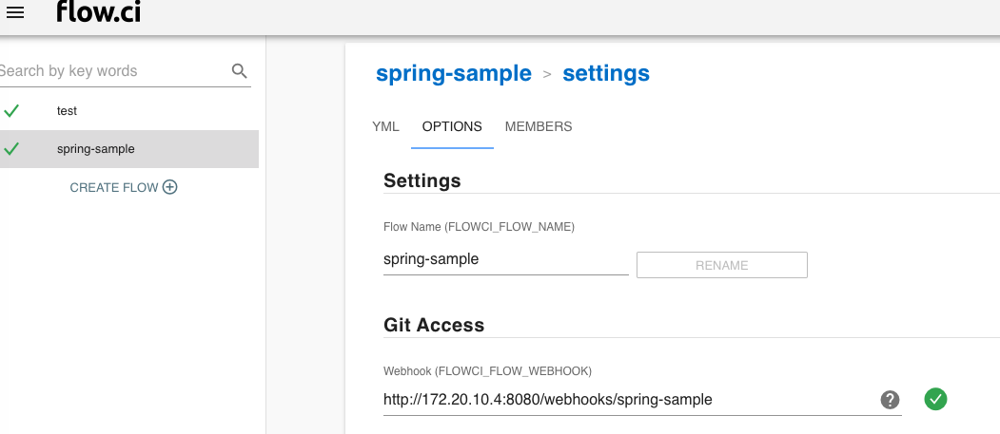
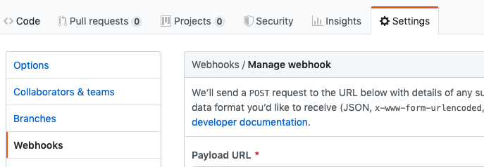
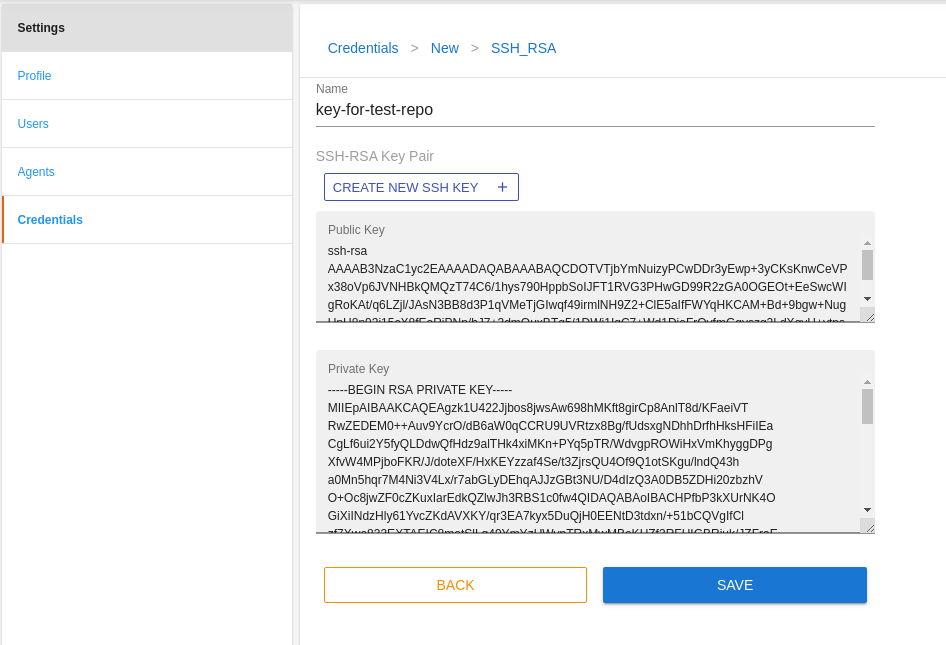
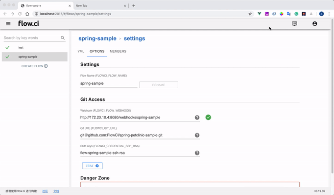

# GitHub Configuration

## Setup Webhook

The webhook used for receive git notification such as push, tag, pull request and so on.

1. Copy webhook url from flow settings
    > Hint: Your host must be exposed to internet (public ip or domain), otherwide the github events can not be received.
    > If pulbic ip or domain not availble in your environments, please use the tools like [ngrok](https://ngrok.com/).  

   

2. Open webhook from GitHub settings

   

3. Setup webhook

    - Payload URL

      Paste webhook url copied from flow settings (step 1)

      > If using `ngrok`, please replace wehbook url by ngrok, ex: `http://172.20.10.4/webhooks/spring-sample` to `http://7e9ea9dc.ngrok.io/webhooks/spring-sample`

    - Content type

      Select content type to `application/json`

    

4. Select events

    - Select `Let me select individual events`
    - Check events `push` and `pull request`

    

## Setup Deploy Key

1. Create SSH-RSA
  
   Create a new ssh-rsa or add an existing to gain git repo access right.

    - Given a name: name used for identify which ssh-rsa will be applied in the flow
    - Generate new or peast existing public and private key

    

2. GitHub setup

    Copy `public key` and add deploy key to Github repo `Settings > Deploy key` for single repo access. Github not allowed to add same public key for muliple repositories, we recommend to have a special 'CI user' to manage single public key access: [adding new ssh key to your github account](https://help.github.com/en/articles/adding-a-new-ssh-key-to-your-github-account).

    

3. YAML setup

   `FLOWCI_GIT_CREDENTIAL` is used for [git clone plugin](https://github.com/gy2006/flowci-plugin-gitclone). Example:

   ```yaml
    envs:
      FLOWCI_GIT_CREDENTIAL: "key-for-test-repo"

    steps:
    - name: clone
      plugin: 'gitclone'
   ```
  
    or

   ```yaml
    steps:
    - name: clone
      envs:
        FLOWCI_GIT_CREDENTIAL: "key-for-test-repo"
      plugin: 'gitclone'
   ```

## - Verify Git Settings

- Webhook:

  The green check box will be shown after 'webhook' field if the flow receive the 'ping' request after GitHub webhook created.

- Deploy Key:
  
  Test the access right from flow settings by click 'test' button, the green will be shown if everything correct.

