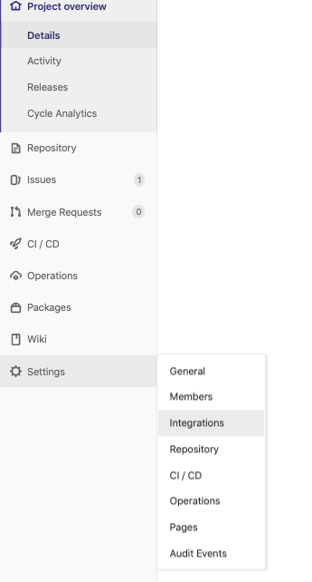

# GitLab Configuration

## Setup Webhook

The webhook used for receive git notification such as push, tag, pull request and so on.

1. Copy webhook url from flow settings
    > Hint: Your host must be exposed to internet (public ip or domain), otherwide the gitlab events can not be received.
    > If pulbic ip or domain not availble in your environments, please use the tools like [ngrok](https://ngrok.com/).  

   

2. Open webhook from GitLab settings
    
   from `Settings` -> `Integrations`

   

3. Setup webhook

- URL
  
  Paste webhook url copied from flow settings (step 1)

  > If using `ngrok`, please replace wehbook url by ngrok, ex: `http://172.20.10.4/webhooks/spring-sample` to `http://7e9ea9dc.ngrok.io/webhooks/spring-sample`

- Select events
  
  Check events `Push events`, `Tag push events` and `Merge request events`
  
  

## Setup Deploy Key

## Verify Git Settings
