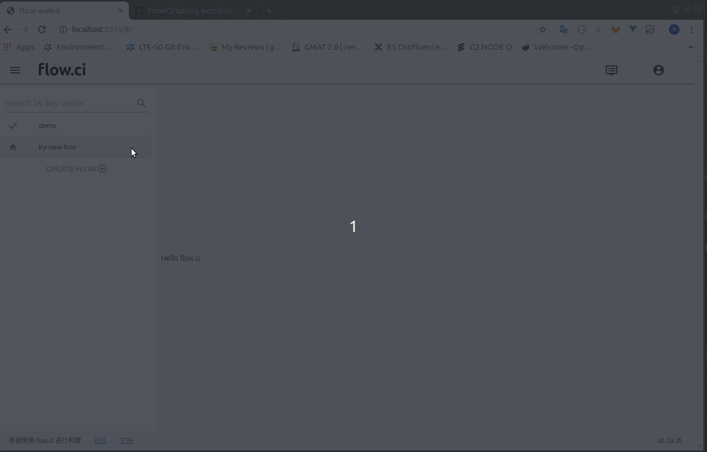

# First Build

## 1. Create a flow (pipeline)

- Give a name
  - Click 'create flow' from left panel
  - Input name of flow
  - The flow will be created directly without Git setup
  
- Git Setup (optional)
  
  > Optional step, it can be done from YAML configuration after flow created

  - Config Git URL

    - `webhook`: url used for receive git events (push, tag, pull request), please using the url shown on 'Webhook' field.
    
    - `git url`: fill in repo remote url copied from git, support both `git@:` and `https://`
  
  - Config Git Access

    Generate new or use an existing ssh-rsa key: [GitHub](../git/github.md), [GitLab](../git/github.md), [Gogs](../git/github.md)

  - Test Git Connection

    Click 'test' button to test git repo access right, or click 'finish' to create flow without test.

    

## 2. Setup YAML

flow.ci will create a sample yaml after the flow created by default, or try with simple [templates](https://github.com/FlowCI/templates).

For more detail, goto [YAML Configuration](../yml/reference_v1.md) chapter

## 3. Setup Agent

Agent is the application to execute flow jobs

- Click `Settings` -> `Agents` -> `+` to add agent
- Copy the token
- [Start agent from docker](https://github.com/FlowCI/docker/blob/master/README.md)

## 4. Start build

- Manually

  Click `Run` button from flow page

- Trigger (if webhook setup correctly)
  - Push
  - Tag
  - Pull Request

## Demo
  
